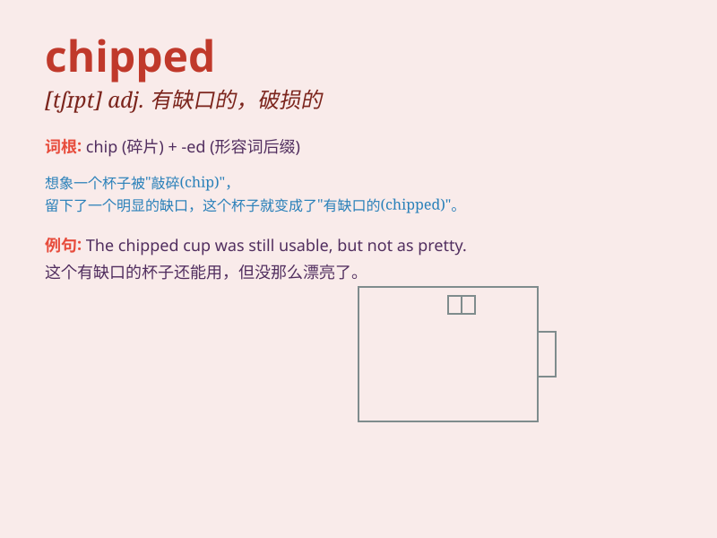

## chipped

**英音:** _[tʃɪpt]_ **美音:** _[tʃɪpt]_

**译义:** *adj.有缺口的,用碎片组成的*

### 短语

+ **chipped paint:** _剥落的油漆_

+ **chipped tooth:** _ chipped tooth
是指牙齿表面出现小裂痕或小块脱落的情况。_

+ **chipped glass:** _ chipped glass
是指玻璃表面出现小裂痕或小块脱落的情况。_

+ **chipped nail:** _ chipped nail
是指指甲表面出现小裂痕或小块脱落的情况。_

+ **chipped edge:** _ chipped edge
是指物体边缘出现小裂痕或小块脱落的情况。_

### 例句

#### 例句1

> **The cup has a chipped edge.**

**中文翻译:** 这个杯子有一个缺口的边缘。

**单词释义:** 有缺口的；破损的

#### 例句2

> **He chipped the paint off the wall.**

**中文翻译:** 他从墙上剥落了油漆。

**单词释义:** 剥落；削掉

#### 例句3

> **She chipped a tooth while eating nuts.**

**中文翻译:** 她吃坚果的时候磕掉了一颗牙。

**单词释义:** 磕掉；碰掉

### 背诵小故事

> One day, I was playing football and accidentally chipped the corner
of the wall. The small piece that broke off was called a \'chip\'. So,
remember, \'chipped\' means having a small piece broken off.

**有一天，我在踢足球，不小心把墙角碰掉了一小块。掉下来的这小块就叫'碎片'。所以，记住，'chipped'意思是有小块破损掉落。**

### 图义

