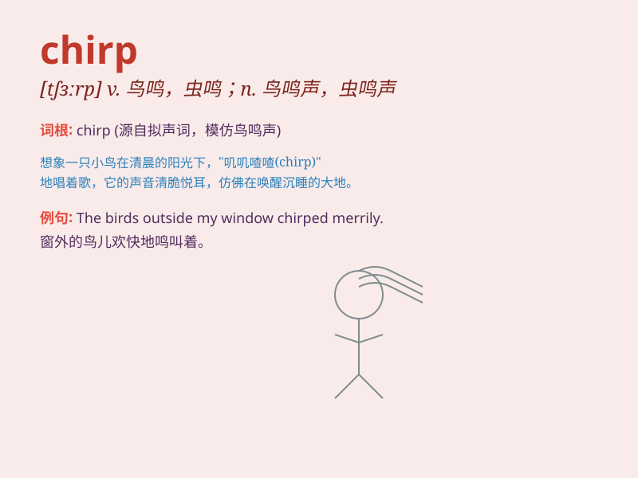

## chirp

**英音:** _[tʃɜːp]_ **美音:** _[tʃɝp]_

**译义:** *n.喳喳声,唧唧声v.吱喳而鸣,尖声地说*

### 短语

+ **chirp away:** _唧唧喳喳地说个不停_

+ **chirp happily:** _欢快地鸣叫_

+ **chirp loudly:** _大声地唧唧叫_

+ **chirp continuously:** _连续地鸣叫_

+ **chirp in the tree:** _在树上鸣叫_

### 例句

#### 例句1

> **The birds chirp happily in the trees.**

**中文翻译:** 鸟儿在树上欢快地鸣叫。

**单词释义:** 鸣叫

#### 例句2

> **The crickets chirp loudly at night.**

**中文翻译:** 蟋蟀在夜晚大声地唧唧叫。

**单词释义:** 唧唧叫

#### 例句3

> **The little sparrow chirped as it hopped along the branch.**

**中文翻译:** 小麻雀一边沿着树枝跳跃一边鸣叫。

**单词释义:** 鸣叫

### 背诵小故事

> One sunny day, a little bird was sitting on a branch. It kept
chirping happily, as if telling the world about its joy. The clear and
lively chirp attracted many passers-by to stop and enjoy the beautiful
sound.

**在一个阳光明媚的日子里，一只小鸟坐在树枝上。它不停地欢快地唧唧叫，仿佛在向世界诉说它的快乐。那清脆活泼的唧唧叫声吸引了许多路人驻足欣赏这美妙的声音。**

### 图义

