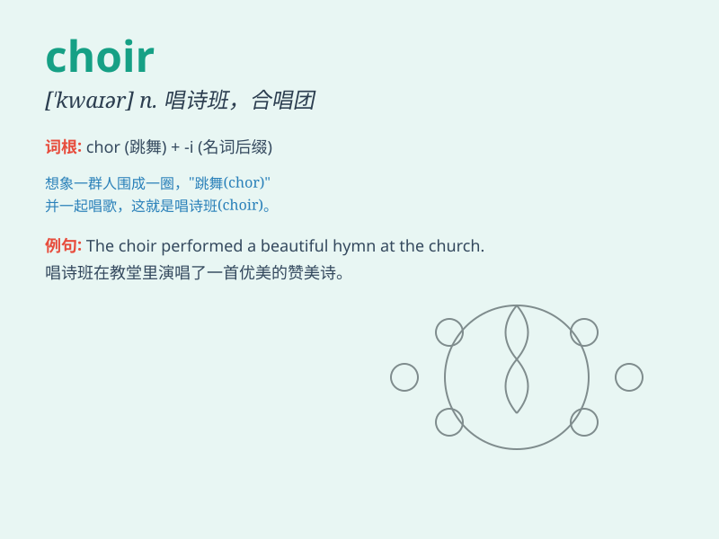

## choir

**英音:** _[\'kwaɪə]_ **美音:** _[\'kwaɪɚ]_

**译义:** *n.唱诗班,唱诗班的席位*

### 短语

+ **church choir:** _教堂唱诗班_

+ **choir loft:** _唱诗班楼厢_

+ **choir practice:** _唱诗班练习_

+ **join the choir:** _加入唱诗班_

+ **choir director:** _唱诗班指挥_

### 例句

#### 例句1

> **The choir sang beautifully at the concert.**

**中文翻译:** 唱诗班在音乐会上唱得很美。

**单词释义:** 唱诗班；合唱团

#### 例句2

> **She joined the school choir last year.**

**中文翻译:** 她去年加入了学校合唱团。

**单词释义:** 合唱团

#### 例句3

> **The choir\'s performance received a standing ovation.**

**中文翻译:** 合唱团的表演赢得了全场起立鼓掌。

**单词释义:** 合唱团

### 背诵小故事

>
想象一下，在一个古老的教堂里，一群孩子整齐地站成一排，他们的歌声像鸟儿的合唱（choir）一样美妙动听。他们的声音融合在一起，充满了整个教堂，给人们带来心灵的慰藉。

**想象在教堂里一群孩子美妙整齐的歌声，帮助记忆
choir（唱诗班；合唱团）这个单词。**

### 图义

