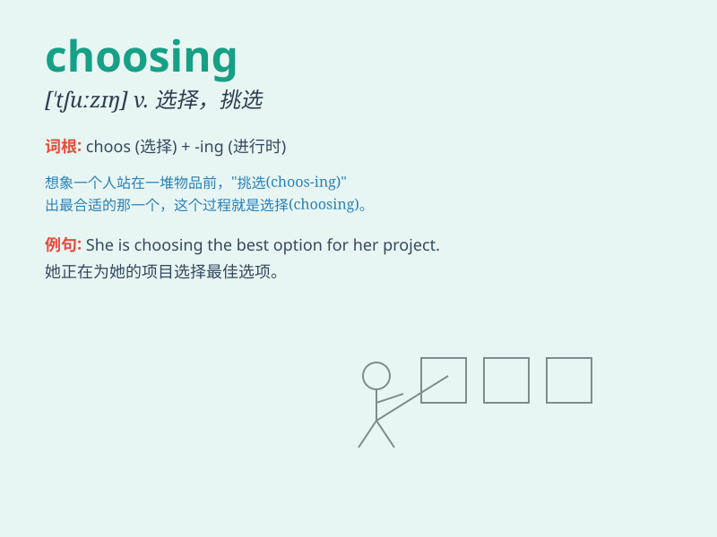

## choosing

**英音:** _[ˈtʃuːzɪŋ]_ **美音:** _[ˈtʃuːzɪŋ]_

**译义:** *vbl.选择,决定*

### 短语

+ **choosing carefully:** _仔细选择_

+ **choosing options:** _选择选项_

+ **choosing a career:** _选择职业_

+ **choosing a gift:** _挑选礼物_

+ **choosing a destination:** _选择目的地_

### 例句

#### 例句1

> **I\'m having trouble choosing between the two options.**

**中文翻译:** 我在这两个选项之间做选择有困难。

**单词释义:** 选择

#### 例句2

> **The act of choosing a career is very important.**

**中文翻译:** 选择职业的行为非常重要。

**单词释义:** 选择

#### 例句3

> **She spent hours choosing the perfect dress for the party.**

**中文翻译:** 她花了几个小时为聚会挑选完美的裙子。

**单词释义:** 挑选

### 背诵小故事

> One day, Alice was in a big store, facing many beautiful dresses. She
spent a long time choosing the one that suited her best. Finally, she
picked a lovely blue dress and was very happy.

**一天，爱丽丝在一家大商店里，面对着许多漂亮的裙子。她花了很长时间挑选最适合她的那件。最后，她选了一件可爱的蓝色裙子，非常开心。**

### 图义

