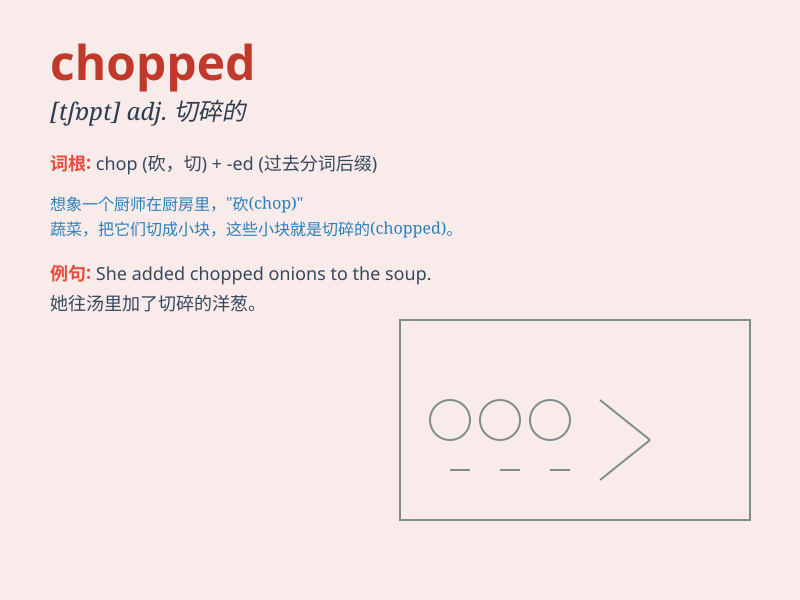

## chopped

**英音:** _[tʃɒpt]_ **美音:** _[tʃɑpt]_

**译义:** *adj.切碎的；被砍的；v.砍，劈（chop
的过去式和过去分词形式）*

### 短语

+ **chopped liver:** _不重要的人或物_

+ **chopped nuts:** _切碎的坚果_

+ **chopped herbs:** _切碎的香草_

+ **chopped tomatoes:** _切碎的西红柿_

+ **chopped wood:** _劈好的木柴_

### 例句

#### 例句1

> **The chef chopped the vegetables into small pieces.**

**中文翻译:** 厨师把蔬菜切成了小块。

**单词释义:** 砍，剁

#### 例句2

> **He chopped down the old tree in the garden.**

**中文翻译:** 他把花园里的那棵老树砍倒了。

**单词释义:** 砍倒

#### 例句3

> **The waves chopped at the boat.**

**中文翻译:** 海浪拍打着小船。

**单词释义:** 猛击，拍打

### 背诵小故事

> A brave woodcutter chopped the big tree into pieces. But suddenly, a
fairy appeared and said, \'You should be careful when chopped!\' The
woodcutter learned his lesson.

**一位勇敢的伐木工把大树砍成了碎块。但突然，一个仙女出现并说：'当你砍伐的时候应该小心！'伐木工得到了教训。**

### 图义

