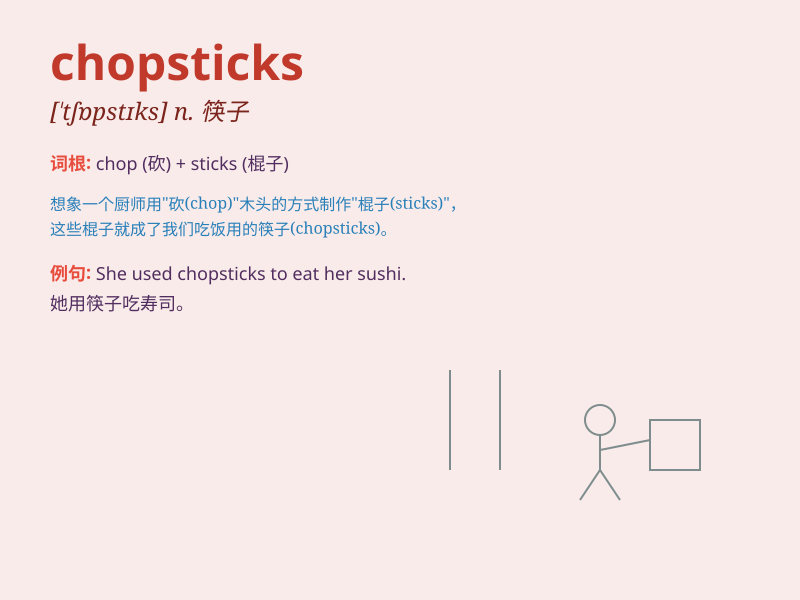

## chopsticks

**英音:** _[\'tʃɒpstɪks]_ **美音:** _[\'tʃɑp,stɪks]_

**译义:** *n.筷子*

### 短语

+ **use chopsticks:** _使用筷子_

+ **pair of chopsticks:** _一双筷子_

+ **wooden chopsticks:** _木制筷子_

+ **disposable chopsticks:** _一次性筷子_

+ **metal chopsticks:** _金属筷子_

### 例句

#### 例句1

> **I can use chopsticks to eat noodles.**

**中文翻译:** 我可以用筷子吃面条。

**单词释义:** 筷子

#### 例句2

> **The chopsticks on the table are made of bamboo.**

**中文翻译:** 桌子上的筷子是竹子做的。

**单词释义:** 筷子

#### 例句3

> **She taught me how to hold chopsticks properly.**

**中文翻译:** 她教我如何正确地拿筷子。

**单词释义:** 筷子

### 背诵小故事

> One day, a little monkey was hungry. It found some food but needed
chopsticks to eat. It looked everywhere and finally got the chopsticks.
With them, it enjoyed the meal happily.

**有一天，一只小猴子饿了。它找到了一些食物，但需要筷子才能吃。它到处找，最后找到了筷子。用它们，它开心地享用了这顿饭。**

### 图义

