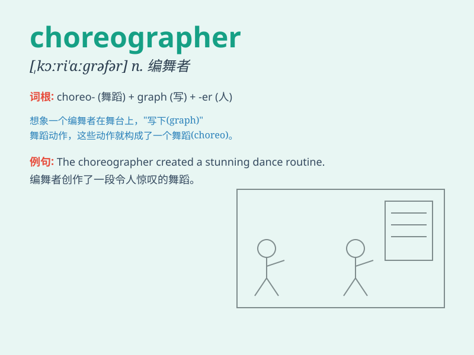

## choreographer

**英音:** _[ˌkɒriˈɒɡrəfə(r)]_ **美音:**
_[ˌkɔːriˈɑːɡrəfər]_

**译义:** *n.舞蹈指导*

### 短语

+ **professional choreographer:** _专业编舞师_

+ **acclaimed choreographer:** _备受赞誉的编舞师_

+ **talented choreographer:** _有才华的编舞师_

+ **creative choreographer:** _有创造力的编舞师_

+ **renowned choreographer:** _著名的编舞师_

### 例句

#### 例句1

> **The choreographer created a stunning dance routine for the
ballet.**

**中文翻译:** 这位编舞家为芭蕾舞创作了一个令人惊叹的舞蹈套路。

**单词释义:** 编舞家

#### 例句2

> **She is widely regarded as one of the most talented choreographers
in the industry.**

**中文翻译:** 她被广泛认为是该行业中最有才华的编舞家之一。

**单词释义:** 编舞家

#### 例句3

> **The choreographer worked closely with the dancers to perfect the
performance.**

**中文翻译:** 这位编舞家与舞者们密切合作，以完善表演。

**单词释义:** 编舞家

### 背诵小故事

>
想象一下，有个名叫乔的人（cho），他热爱音乐（re），总是给歌手们安排舞蹈动作。有一天，他成功了，成为了著名的舞蹈编导（choreographer）。

**想象有个叫乔的人热爱音乐，给歌手安排舞蹈动作，最终成为著名舞蹈编导的故事，帮助记忆
choreographer 这个单词**

### 图义

