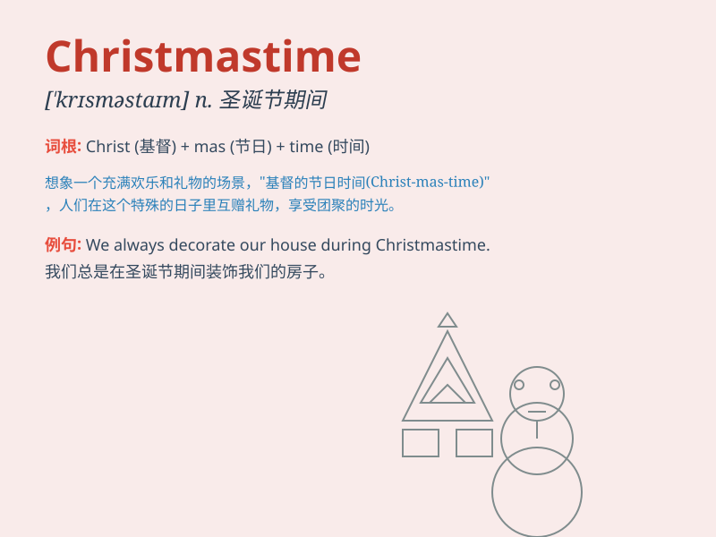

## Christmastime

**英音:** _[ˈkrɪsməstaɪm]_ **美音:** _[ˈkrɪsməstaɪm]_

**译义:** *n.圣诞节期间，圣诞时节*

### 短语

+ **At Christmastime:** _在圣诞节期间_

+ **During Christmastime:** _在圣诞节期间_

+ **Christmastime celebration:** _圣诞节庆祝活动_

+ **Christmastime joy:** _圣诞节的欢乐_

+ **Christmastime spirit:** _圣诞精神_

### 例句

#### 例句1

> **Christmastime is always a joyous occasion for families to gather
together.**

**中文翻译:** 圣诞节期间总是一个欢乐的时刻，家人们聚在一起。

**单词释义:** 圣诞节期间

#### 例句2

> **During Christmastime, the streets are decorated with colorful
lights.**

**中文翻译:** 在圣诞节期间，街道上装饰着五颜六色的灯。

**单词释义:** 在圣诞节期间

#### 例句3

> **I love the atmosphere of Christmastime with all the carols and
gifts.**

**中文翻译:** 我喜欢圣诞节期间的氛围，有所有的颂歌和礼物。

**单词释义:** 圣诞节期间

### 背诵小故事

> At Christmastime, Santa Claus rides his sleigh through the snowy
night. Kids wait excitedly for presents. Families gather around the
decorated tree, singing carols and sharing joy. It\'s a magical time
full of love and happiness.

**在圣诞节期间，圣诞老人乘着他的雪橇穿过雪夜。孩子们兴奋地等待礼物。家人们围在装饰好的圣诞树旁，唱着颂歌，分享着快乐。这是一个充满爱和幸福的神奇时刻。**

### 图义

