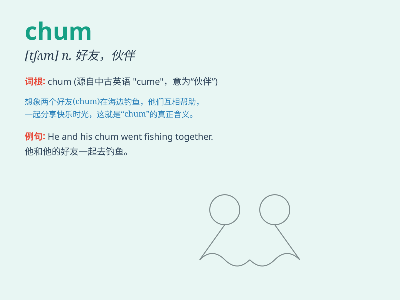

## chum

**英音:** _[tʃʌm]_ **美音:** _[tʃʌm]_

**译义:** *n.\<俗>(特指男孩子之间)密友,室友vi.结为密友(与up连用)*

### 短语

+ **chum up:** _成为好友，变得友好_

+ **chum around:** _结伴，一起闲逛_

+ **old chum:** _老朋友，老兄_

+ **chum buddy:** _密友，好友_

+ **chum together:** _在一起，相聚_

### 例句

#### 例句1

> **He\'s my chum from school days.**

**中文翻译:** 他是我学生时代的好友。

**单词释义:** 朋友，伙伴

#### 例句2

> **We became chums when we went camping together.**

**中文翻译:** 我们一起去露营的时候成了好朋友。

**单词释义:** 好友

#### 例句3

> **She always hangs out with her chum on weekends.**

**中文翻译:** 她周末总是和她的朋友一起出去玩。

**单词释义:** 朋友

### 背诵小故事

> One day, I was lost in a strange city. Suddenly, I met a kind person
who became my chum. He showed me around and helped me a lot. We had a
great time together and became good friends.

**有一天，我在一个陌生的城市迷路了。突然，我遇到了一个善良的人，他成了我的密友。他带我四处转转，帮了我很多。我们在一起度过了愉快的时光，成为了好朋友。**

### 图义

