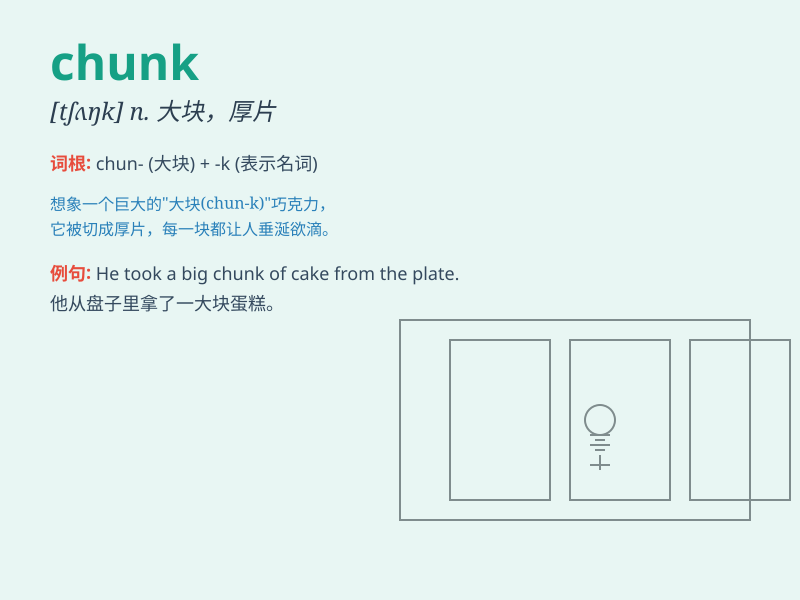

## chunk

**英音:** _[tʃʌŋk]_ **美音:** _[tʃʌŋk]_

**译义:** *n.大块,矮胖的人或物*

### 短语

+ **a chunk of:** _一大块；大量_

+ **chunk out:** _（因故障等）停止运转_

+ **chunk up:** _切成大块；分成大份_

+ **in chunks:** _成块；分批_

+ **break into chunks:** _破碎成块_

### 例句

#### 例句1

> **He cut the meat into chunks.**

**中文翻译:** 他把肉切成了大块。

**单词释义:** 大块；厚块

#### 例句2

> **A chunk of the building collapsed in the earthquake.**

**中文翻译:** 这座建筑物的一大块在地震中倒塌了。

**单词释义:** 一大块；一部分

#### 例句3

> **The program is divided into several chunks for easier
understanding.**

**中文翻译:** 这个程序被分成几个部分以便于理解。

**单词释义:** 部分；组块

### 背诵小故事

> A hungry bear found a big chunk of honeycomb. It was so heavy that
the bear struggled to carry it. But the sweet taste of the honey in the
chunk made all the effort worth it.

**一只饥饿的熊发现了一大块蜂巢。它太重了，熊费力地搬着。但这块蜂巢里蜂蜜的甜味让所有的努力都值得了。**

### 图义

