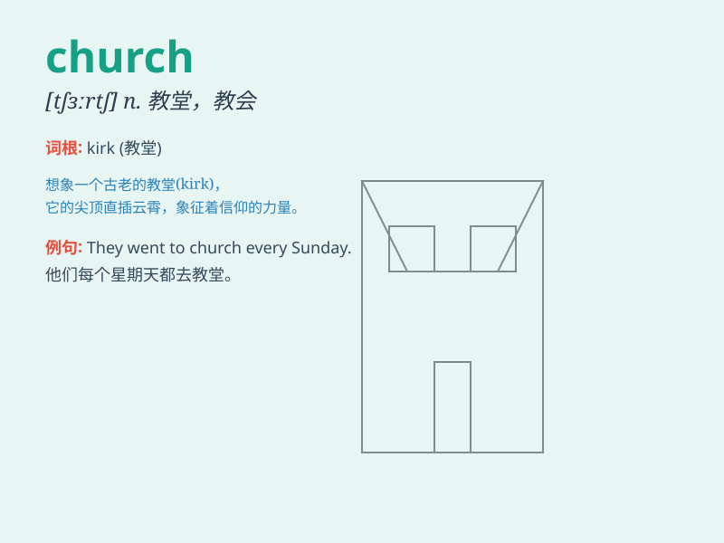

## church

**英音:** _[tʃɜːtʃ]_ **美音:** _[tʃɝtʃ]_

**译义:** *n.教堂,礼拜堂,教会,教派,[宗]礼拜*

### 短语

+ **go to church:** _去教堂做礼拜_

+ **church service:** _教堂礼拜仪式_

+ **church bell:** _教堂的钟_

+ **church choir:** _教堂唱诗班_

+ **church steeple:** _教堂尖塔_

### 例句

#### 例句1

> **We go to church every Sunday.**

**中文翻译:** 我们每个星期天都去教堂。

**单词释义:** 教堂

#### 例句2

> **The church was built in the 18th century.**

**中文翻译:** 这座教堂建于 18 世纪。

**单词释义:** 教堂

#### 例句3

> **She got married in a beautiful church.**

**中文翻译:** 她在一座美丽的教堂里结婚。

**单词释义:** 教堂

### 背诵小故事

> One day, a little boy was lost. He wandered around and finally saw a
big building with a cross on top. It was a church. People inside were
praying peacefully. The boy felt safe and found his way home with their
help.

**有一天，一个小男孩迷路了。他四处游荡，最后看到了一座顶部有十字架的大建筑。这是一座教堂。里面的人们正在安静地祈祷。在他们的帮助下，男孩感到安全并找到了回家的路。**

### 图义

