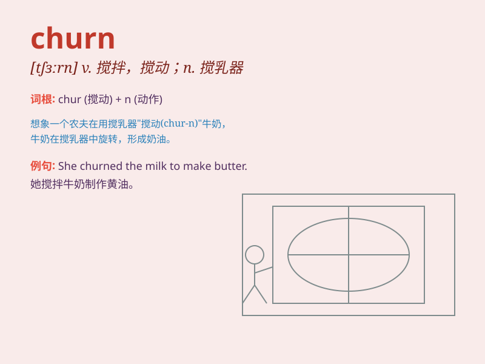

## churn

**英音:** _[tʃɜːn]_ **美音:** _[tʃɝn]_

**译义:** *n.搅乳器v.搅拌,搅动*

### 短语

+ **churn out:** _大量生产；粗制滥造_

+ **churn up:** _翻起；搅动；使不安_

+ **mental churn:** _精神上的动荡；内心的不安_

+ **customer churn:** _客户流失_

+ **emotional churn:** _情绪波动_

### 例句

#### 例句1

> **The waves churned the sand on the beach.**

**中文翻译:** 海浪搅动了海滩上的沙子。

**单词释义:** 搅动；翻腾

#### 例句2

> **The old machine was churning out defective products.**

**中文翻译:** 那台旧机器正在大量生产次品。

**单词释义:** 大量生产

#### 例句3

> **Her stomach was churning with nerves before the exam.**

**中文翻译:** 考试前她紧张得胃里翻腾。

**单词释义:** （肠胃）翻腾

### 背诵小故事

>
想象一个农场，有一台老旧的搅拌器（churn）。每天，农民都费力地用它搅动牛奶来制作黄油。这台搅拌器嘎吱作响，不停地转动，就像单词churn所表达的'剧烈搅动；翻腾'的意思。

**想象农场中老旧搅拌器费力搅动牛奶的情景来辅助记忆单词churn'剧烈搅动；翻腾'的意思**

### 图义

