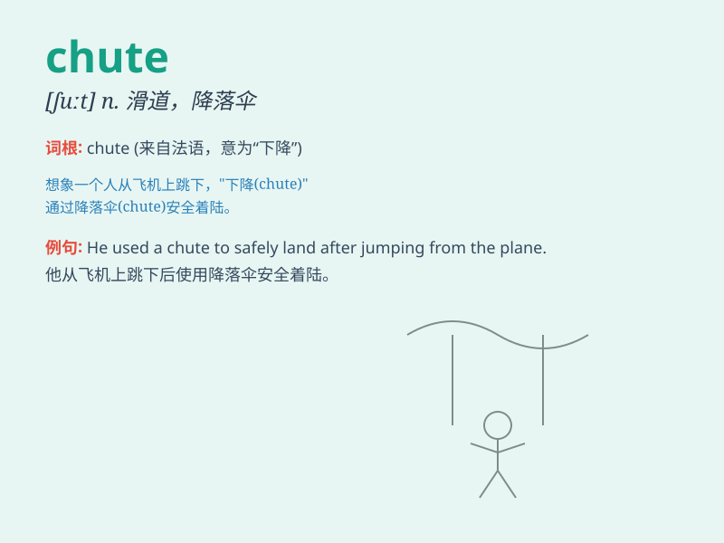

## chute

**英音:** _[ʃuːt]_ **美音:** _[ʃut]_

**译义:** *n.瀑布,斜道*

### 短语

+ **parachute chute:** _降落伞滑道_

+ **grain chute:** _谷物滑道_

+ **water chute:** _水滑道_

+ **sliding chute:** _滑动斜槽_

+ **delivery chute:** _卸料溜槽_

### 例句

#### 例句1

> **The skydiver jumped out of the plane and relied on the chute to
land safely.**

**中文翻译:** 这位跳伞者跳出飞机并依靠降落伞安全着陆。

**单词释义:** 降落伞

#### 例句2

> **The water rushed down the chute and into the pool.**

**中文翻译:** 水顺着滑道冲下来，流进了水池。

**单词释义:** 滑道；滑槽

#### 例句3

> **The mail was sent down the chute to the sorting room.**

**中文翻译:** 邮件通过斜槽被送到分拣室。

**单词释义:** 斜槽；溜槽

### 背诵小故事

> A brave adventurer was skydiving. As he jumped out of the plane, he
relied on the chute to safely land. The chute opened smoothly, and he
enjoyed the thrilling descent. Remember, chute is the parachute that
saves lives!

**一位勇敢的冒险家正在跳伞。当他从飞机上跳下时，依靠着降落伞安全着陆。降落伞顺利打开，他享受着这惊险的降落。记住，chute
就是降落伞，能救命！**

### 图义

