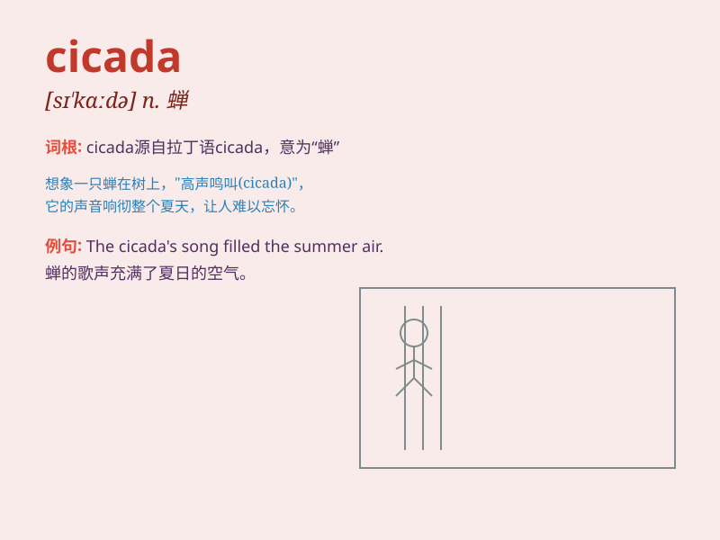

## cicada

**英音:** _[sɪ\'kɑːdə]_ **美音:** _[sɪ\'kedɚ]_

**译义:** *n.蝉*

### 短语

+ **periodical cicada:** _周期性蝉_

+ **cicada killer:** _杀蝉泥蜂_

+ **cicada shell:** _蝉蜕_

+ **loud cicada:** _响亮的蝉_

+ **singing cicada:** _鸣蝉_

### 例句

#### 例句1

> **The cicada\'s song filled the hot summer afternoon.**

**中文翻译:** 蝉的歌声充满了炎热的夏日午后。

**单词释义:** 蝉

#### 例句2

> **We caught a cicada in the park.**

**中文翻译:** 我们在公园里捉到了一只蝉。

**单词释义:** 蝉

#### 例句3

> **The cicada emerged from its shell and took flight.**

**中文翻译:** 蝉从壳里出来飞走了。

**单词释义:** 蝉

### 背诵小故事

> In the hot summer, a little boy was playing in the garden. Suddenly,
he heard a loud noise. Looking up, he saw a cicada singing on a tree
branch. The cicada\'s song was so special that the boy never forgot it.

**在炎热的夏天，一个小男孩正在花园里玩耍。突然，他听到一阵响亮的声音。抬头一看，他看到一只蝉在树枝上歌唱。蝉的歌声如此特别，男孩永远忘不了。**

### 图义

