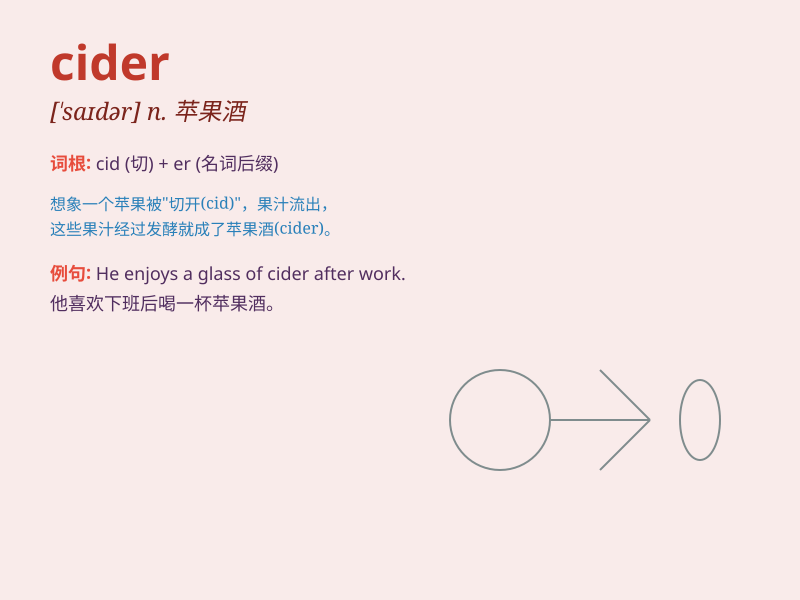

## cider

**英音:** _[\'saɪdə]_ **美音:** _[\'saɪdɚ]_

**译义:** *n.苹果酒*

### 短语

+ **apple cider:** _苹果酒_

+ **hard cider:** _烈性苹果酒_

+ **cider vinegar:** _苹果醋_

+ **sweet cider:** _甜苹果酒_

+ **sparkling cider:** _起泡苹果酒_

### 例句

#### 例句1

> **I enjoy drinking cider on a hot summer day.**

**中文翻译:** 我喜欢在炎热的夏日喝苹果酒。

**单词释义:** 苹果酒

#### 例句2

> **The local pub serves excellent cider.**

**中文翻译:** 当地的酒吧供应优质的苹果酒。

**单词释义:** 苹果酒

#### 例句3

> **She made her own cider from apples in the orchard.**

**中文翻译:** 她用果园里的苹果自制了苹果酒。

**单词释义:** 苹果酒

### 背诵小故事

> One hot summer day, Tom was very thirsty. He found a farm and the
farmer gave him a glass of cider. The sweet and refreshing cider made
Tom feel so cool and happy.

**在一个炎热的夏日，汤姆非常口渴。他找到了一个农场，农夫给了他一杯苹果酒。那甘甜清爽的苹果酒让汤姆感到十分清凉和开心。**

### 图义

