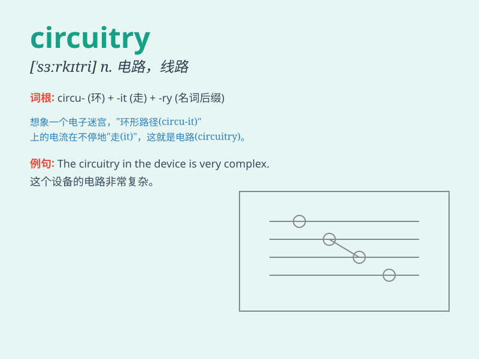

## circuitry

**英音:** _[\'sɜːkɪtrɪ]_ **美音:** _[\'sɝkɪtri]_

**译义:** *n.电路,线路*

### 短语

+ **electronic circuitry:** _电子电路_

+ **complex circuitry:** _复杂的电路_

+ **circuitry design:** _电路设计_

+ **integrated circuitry:** _集成电路_

+ **circuitry component:** _电路元件_

### 例句

#### 例句1

> **The circuitry of this computer is very complex.**

**中文翻译:** 这台电脑的电路系统非常复杂。

**单词释义:** 电路系统

#### 例句2

> **He is an expert in circuitry design.**

**中文翻译:** 他是电路设计方面的专家。

**单词释义:** 电路

#### 例句3

> **The damage to the circuitry caused the machine to
malfunction.**

**中文翻译:** 电路的损坏导致机器故障。

**单词释义:** 电路

### 背诵小故事

> A brave explorer was lost in a strange land. He followed the
circuitry of an ancient map, which led him to hidden treasures. The
circuitry was like a path guiding him through the unknown.

**一位勇敢的探险家在一片陌生的土地上迷路了。他沿着一张古老地图的线路（circuitry），找到了隐藏的宝藏。线路就像引导他穿越未知的路径。**

### 图义

