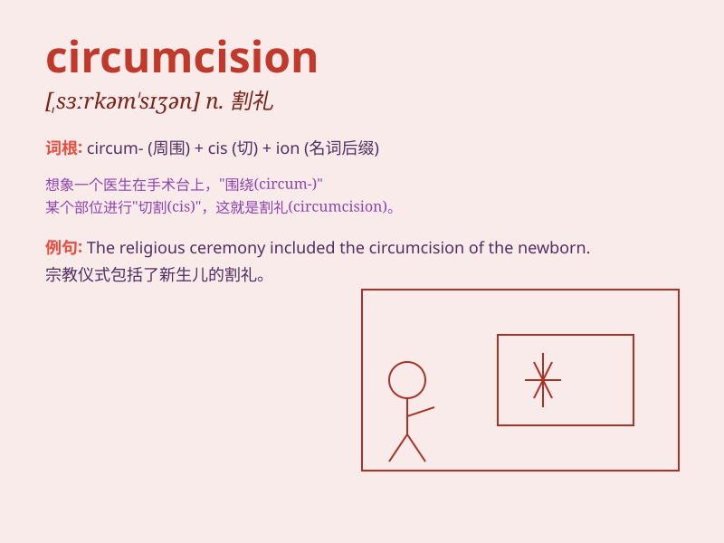

## circumcision

**英音:** _[ˌsɜːrkəmˈsɪʒən]_ **美音:**
_[ˌsɜːrkəmˈsɪʒən]_

**译义:** *n.包皮环切术；割礼*

### 短语

+ **female circumcision:** _女性割礼_

+ **circumcision knife:** _包皮环切刀_

+ **circumcision ceremony:** _割礼仪式_

+ **religious circumcision:** _宗教割礼_

+ **circumcision complication:** _包皮环切术并发症_

### 例句

#### 例句1

> **Circumcision is a common religious practice in some cultures.**

**中文翻译:** 包皮环切术在某些文化中是一种常见的宗教习俗。

**单词释义:** 包皮环切术

#### 例句2

> **The doctor performed a circumcision on the newborn baby.**

**中文翻译:** 医生为新生婴儿进行了包皮环切手术。

**单词释义:** 包皮环切手术

#### 例句3

> **Some people have different opinions on circumcision.**

**中文翻译:** 有些人对包皮环切术有不同的看法。

**单词释义:** 包皮环切术

### 背诵小故事

> A brave boy named Tom was very nervous before the circumcision. But
he gathered courage, knowing it was for his health. Afterward, he felt
relieved and stronger.

**一个叫汤姆的勇敢男孩在环切手术前非常紧张。但他鼓起勇气，知道这是为了他的健康。之后，他感到如释重负并且更坚强了。**

### 图义

