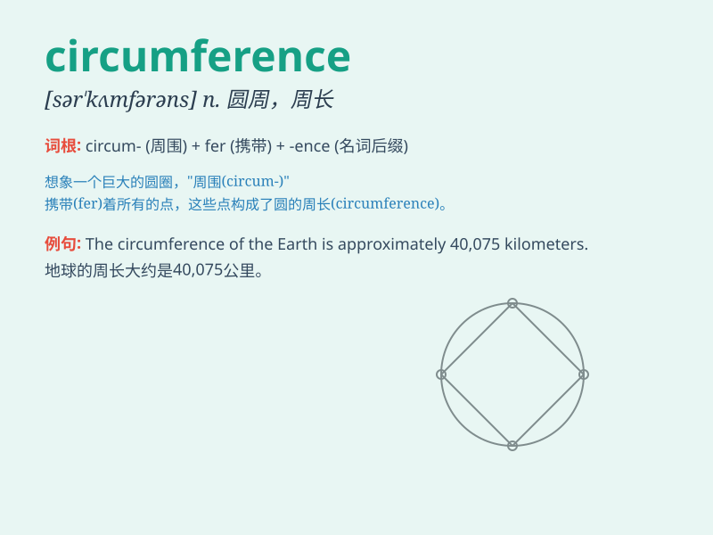

## circumference

**英音:** _[sə\'kʌmf(ə)r(ə)ns]_ **美音:**
_[sɚ\'kʌmfərəns]_

**译义:** *n.圆周,周围*

### 短语

+ **circumference measurement:** _周长测量_

+ **circumference of a circle:** _圆的周长_

+ **calculate the circumference:** _计算周长_

+ **increase in circumference:** _周长的增加_

+ **circumference ratio:** _周长比_

### 例句

#### 例句1

> **The circumference of the earth is about 40,075 kilometers.**

**中文翻译:** 地球的周长约为 40075 公里。

**单词释义:** 周长

#### 例句2

> **The tailor measured the circumference of my waist.**

**中文翻译:** 裁缝量了我的腰围。

**单词释义:** 圆周；围长

#### 例句3

> **The circumference of the tree trunk was too large for one person
to embrace.**

**中文翻译:** 树干的周长太大了，一个人抱不过来。

**单词释义:** 周长；圆周

### 背诵小故事

> A brave explorer was lost in a mysterious forest. He needed to find
the circumference of the forest to know the distance. He walked along
the edge and finally measured it. Now he could escape!

**一位勇敢的探险家在一个神秘的森林里迷路了。他需要找到森林的周长来知晓距离。他沿着边缘走，最终测量出了它。现在他能够逃脱了！**

### 图义

