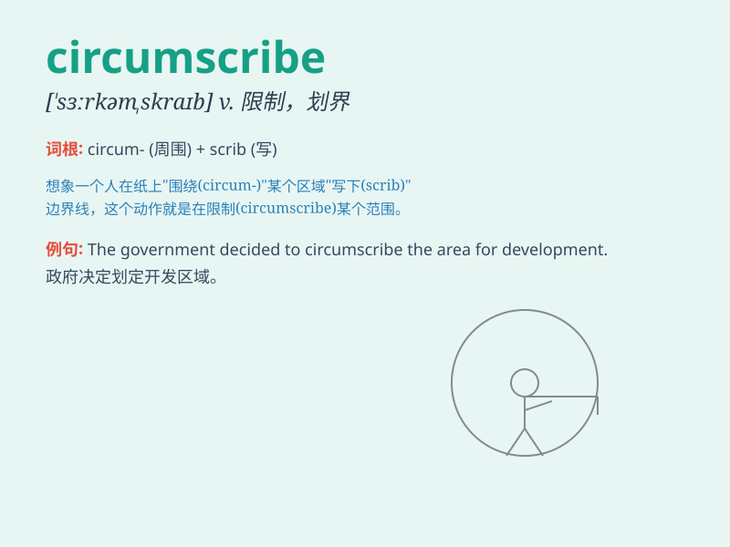

## circumscribe

**英音:** _[\'sɜːkəmskraɪb]_ **美音:** _[,sɝkəm\'sraɪb]_

**译义:** *vt.在\...周围画线,限制*

### 短语

+ **circumscribe one\'s activities:** _限制某人的活动_

+ **circumscribe the power:** _限制权力_

+ **circumscribe the influence:** _限制影响_

+ **circumscribe the area:** _划定区域_

+ **circumscribe the scope:** _限定范围_

### 例句

#### 例句1

> **The doctor circumscribed the area of infection on the patient\'s
skin.**

**中文翻译:** 医生在病人的皮肤上划定了感染区域。

**单词释义:** 划定

#### 例句2

> **The law circumscribes the powers of the government.**

**中文翻译:** 法律限制了政府的权力。

**单词释义:** 限制

#### 例句3

> **His responsibilities were circumscribed by the terms of the
contract.**

**中文翻译:** 他的职责受到合同条款的约束。

**单词释义:** 约束

### 背诵小故事

> A king wanted to circumscribe the power of his ministers. He drew a
circle around their authority, limiting it. Just like that,
\'circumscribe\' means to limit or restrict something.

**一位国王想要限制他大臣们的权力。他在他们的职权周围画了一个圈，对其进行限制。就像这样，\'circumscribe\'意思是限制或约束某物。**

### 图义

