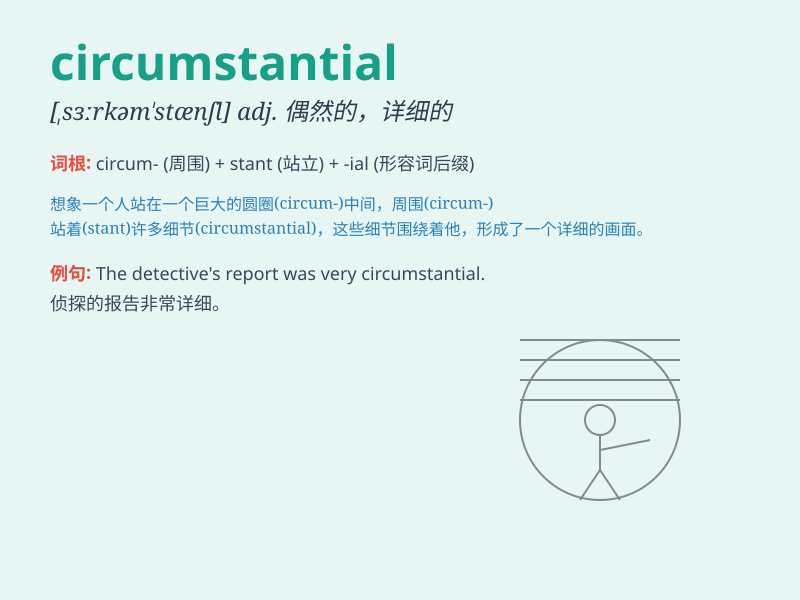

## circumstantial

**英音:** _[sɜːkəm\'stænʃ(ə)l]_ **美音:**
_[,sɝkəm\'stænʃl]_

**译义:** * /n.旁謎ty/\`s:kEm9stAnl/adj.依照情况的//,间接证据*

### 短语

+ **circumstantial evidence:** _间接证据；旁证_

+ **circumstantial report:** _详细的报告；详尽的报道_

+ **circumstantial description:** _详细的描述；详尽的叙述_

+ **circumstantial account:** _详细的陈述；详尽的说明_

+ **circumstantial story:** _情节复杂的故事_

### 例句

#### 例句1

> **The evidence against him was purely circumstantial.**

**中文翻译:** 针对他的证据纯粹是间接的。

**单词释义:** 间接的；依照情况的

#### 例句2

> **Her story was circumstantial but convincing.**

**中文翻译:** 她的叙述虽然详尽但令人信服。

**单词释义:** 详尽的；细节繁多的

#### 例句3

> **The case relied on circumstantial evidence rather than direct
proof.**

**中文翻译:** 这个案子依靠的是间接证据而非直接证明。

**单词释义:** 与环境有关的；取决于环境的

### 背诵小故事

> A detective was solving a case. All the evidence was circumstantial.
There were no direct clues. But by piecing together these circumstantial
details, he finally found the truth.

**一位侦探正在破案。所有的证据都是间接的。没有直接的线索。但通过拼凑这些间接的细节，他最终找到了真相。**

### 图义

