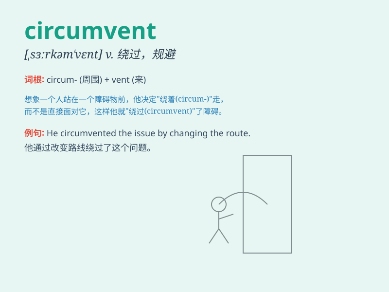

## circumvent

**英音:** _[sɜːkəm\'vent]_ **美音:** _[,sɝkəm\'vɛnt]_

**译义:** *vt.围绕,包围,智取*

### 短语

+ **circumvent the law:** _规避法律_

+ **circumvent a problem:** _绕过问题_

+ **circumvent an obstacle:** _避开障碍_

+ **circumvent a rule:** _违反规则_

+ **circumvent a difficulty:** _克服困难_

### 例句

#### 例句1

> **The company tried to circumvent the new regulations by finding
loopholes.**

**中文翻译:** 这家公司试图通过寻找漏洞来规避新的规定。

**单词释义:** 规避，绕过

#### 例句2

> **He circumvented the problem by using an alternative method.**

**中文翻译:** 他用一种替代方法避开了这个问题。

**单词释义:** 避开，躲开

#### 例句3

> **It\'s not easy to circumvent the security system of this
building.**

**中文翻译:** 要绕过这座大楼的安保系统可不容易。

**单词释义:** 绕过，迂回

### 背诵小故事

> A thief wanted to steal the jewels. He couldn\'t enter through the
front door, so he tried to circumvent the security by climbing over the
back wall. But he was still caught. \'circumvent\' here means to go
around or bypass.

**一个小偷想要偷珠宝。他无法从前门进入，所以试图从后墙爬过去来规避安保。但他还是被抓住了。\'circumvent\'在这里指的是绕行、避开。**

### 图义

