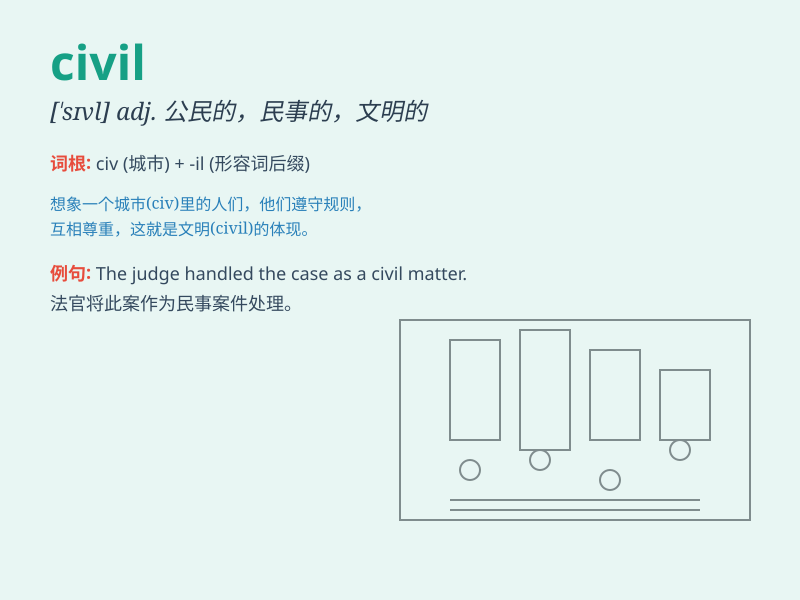

## civil

**英音:** _[\'sɪv(ə)l; -ɪl]_ **美音:** _[\'sɪvl]_

**译义:**
*adj.全民的,市民的,公民的,国民的,民间的.民事的,根据民法的,文职的,有礼貌的*

### 短语

+ **civil rights:** _公民权利_

+ **civil war:** _内战_

+ **civil service:** _行政部门；文职部门_

+ **civil engineering:** _土木工程_

+ **civil disobedience:** _非暴力反抗；温和抵抗_

### 例句

#### 例句1

> **Civil rights are an important aspect of a democratic society.**

**中文翻译:** 公民权利是民主社会的一个重要方面。

**单词释义:** 公民的；平民的

#### 例句2

> **The two countries have maintained civil relations despite their
differences.**

**中文翻译:** 尽管存在分歧，这两个国家仍保持着文明的关系。

**单词释义:** 文明的；有礼貌的

#### 例句3

> **He was involved in a civil lawsuit.**

**中文翻译:** 他卷入了一场民事诉讼。

**单词释义:** 民事的

### 背诵小故事

> A civil engineer was working on a project. He needed to be polite and
respectful to everyone to make the project go smoothly. \'Civil\' means
polite and orderly.

**一位土木工程师正在做一个项目。他需要对每个人都礼貌和尊重，以使项目顺利进行。\'civil\'意思是有礼貌的、有秩序的。**

### 图义

