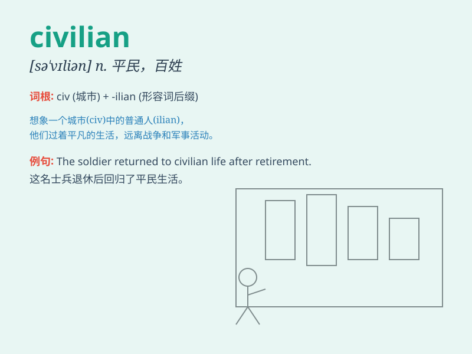

## civilian

**英音:** _[sɪ\'vɪlj(ə)n]_ **美音:** _[sə\'vɪlɪən]_

**译义:** *n.平民,公务员,文官adj.民间的,民用的*

### 短语

+ **civilian population:** _平民人口_

+ **civilian clothes:** _便服_

+ **civilian life:** _平民生活_

+ **civilian casualties:** _平民伤亡_

+ **civilian employee:** _文职雇员_

### 例句

#### 例句1

> **The civilians were caught in the crossfire during the war.**

**中文翻译:** 在战争期间，平民们陷入了交叉火力之中。

**单词释义:** 平民

#### 例句2

> **He left the army and returned to civilian life.**

**中文翻译:** 他离开了军队，回归了平民生活。

**单词释义:** 平民的

#### 例句3

> **The government is responsible for the protection of
civilians.**

**中文翻译:** 政府有责任保护平民。

**单词释义:** 平民

### 背诵小故事

> In a war-torn city, a brave civilian named Lily risked her life to
help others. Despite the danger, she showed that civilians can also be
heroes. She provided food and shelter, giving hope to all.

**在一个饱受战争蹂躏的城市里，一位名叫莉莉的勇敢平民冒着生命危险帮助他人。尽管危险重重，她证明了平民也可以成为英雄。她提供食物和住所，给所有人带来希望。**

### 图义

