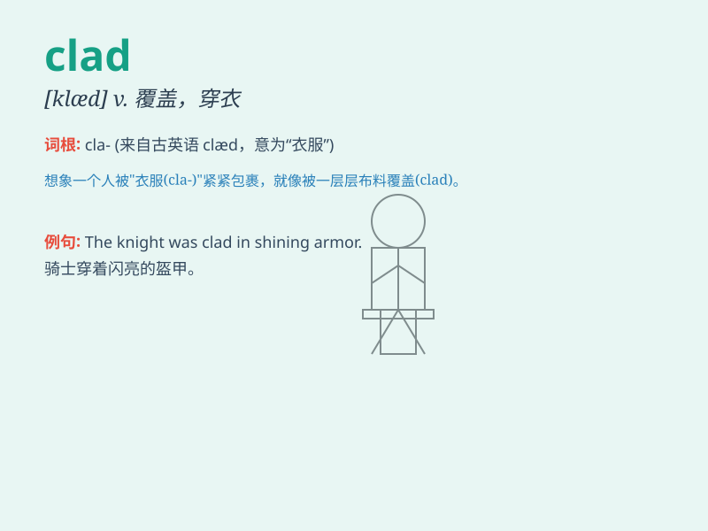

## clad

**英音:** _[klæd]_ **美音:** _[klæd]_

**译义:** *vt.在金属外覆以另一种金属adj.穿衣的
vbl.clothe的过去式和过去分词*

### 短语

+ **be clad in:** _穿着；披着_

+ **clad steel:** _复合钢；包层钢_

+ **clad plate:** _复合板；覆层板_

+ **clad layer:** _覆盖层；镀层_

+ **clad pipe:** _复合管；衬里管_

### 例句

#### 例句1

> **She was clad in a beautiful silk dress.**

**中文翻译:** 她穿着一件漂亮的丝绸连衣裙。

**单词释义:** 穿着（衣服）

#### 例句2

> **The knight was clad in shining armor.**

**中文翻译:** 这位骑士身着闪亮的盔甲。

**单词释义:** 穿着；覆盖着

#### 例句3

> **The mountains were clad in a thick layer of snow.**

**中文翻译:** 群山被厚厚的积雪覆盖着。

**单词释义:** 覆盖；被覆盖

### 背诵小故事

> A knight was clad in shiny armor. He was ready to fight for justice.
The armor protected him and made him look brave. \'Clad\' means dressed
or covered. So, the knight was dressed in the armor.

**一位骑士身着闪亮的盔甲。他准备为正义而战。盔甲保护着他，使他看起来很勇敢。\'clad\'意思是穿着或覆盖。所以，这位骑士穿着盔甲。**

### 图义

