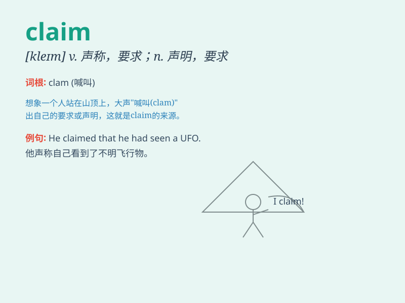

## claim

**英音:** _[kleɪm]_ **美音:** _[klem]_

**译义:**
*n.(根据权利提出)要求,要求权,主张,要求而得到的东西vt.(根据权利)要求,认领,声称,主张,需要*

### 短语

+ **lay claim to:** _声称对......有所有权_

+ **claim damages:** _要求损害赔偿_

+ **put in a claim:** _提出索赔_

+ **false claim:** _虚假的声称_

+ **valid claim:** _有效的主张_

### 例句

#### 例句1

> **He claimed that he was innocent.**

**中文翻译:** 他声称自己是无辜的。

**单词释义:** 声称；宣称

#### 例句2

> **The insurance company received many claims after the
earthquake.**

**中文翻译:** 地震过后，保险公司接到了很多索赔。

**单词释义:** 索赔；索取

#### 例句3

> **She has a claim to the property.**

**中文翻译:** 她对这份财产有所有权。

**单词释义:** 所有权；权利

### 背诵小故事

> A man was lost in the desert and claimed to have seen a hidden oasis.
But no one believed him until he led them to it. The word \'claim\'
means to assert or say that something is true.

**一个男人在沙漠中迷路了，声称看到了一个隐藏的绿洲。但没人相信他，直到他带他们找到了。单词\'claim\'意思是断言或宣称某事是真实的。**

### 图义

