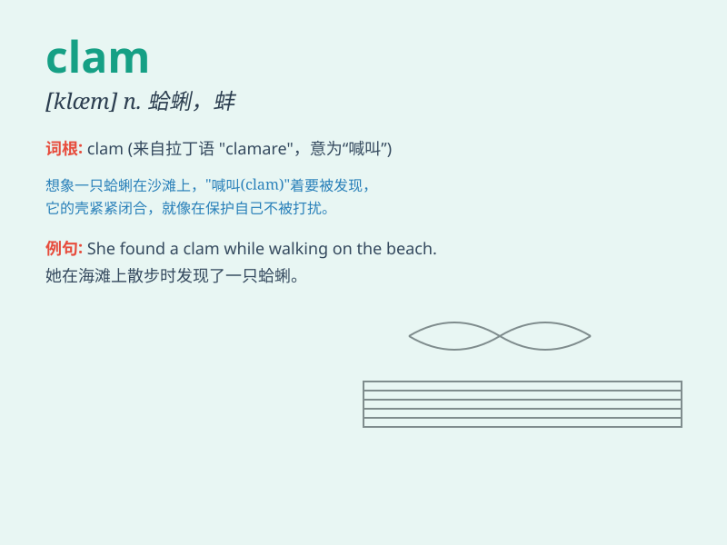

## clam

**英音:** _[klæm]_ **美音:** _[klæm]_

**译义:** *n.蛤; (非正式)钱;缄默vt.使闭口;紧抱;用钳夹紧*

### 短语

+ **clam up:** _突然闭口不言；拒不开口_

+ **clam chowder:** _蛤蜊浓汤_

+ **as happy as a clam:** _非常快活；心满意足_

+ **clam digger:** _挖蛤蜊的人；低腰紧身短裤_

+ **clam shell:** _蛤壳；蚌壳_

### 例句

#### 例句1

> **The clam was hidden in the sand.**

**中文翻译:** 这只蛤蜊藏在沙子里。

**单词释义:** 蛤蜊

#### 例句2

> **She remained clam during the crisis.**

**中文翻译:** 在危机中她保持镇定。

**单词释义:** 沉着的；冷静的；镇定的

#### 例句3

> **The children were as clam as could be while waiting for their
presents.**

**中文翻译:** 孩子们在等待礼物时非常安静。

**单词释义:** 安静的；沉默寡言的

### 背诵小故事

> A man was walking by the sea and saw a clam tightly closed. He tried
to open it but the clam was very stubborn. Finally, he gave up.
Remember, \'clam\' is this shellfish that refuses to open easily!

**一个人在海边散步，看到一只蛤蜊紧紧闭着。他试图打开它，但蛤蜊非常顽固。最后，他放弃了。记住，\'clam\'就是这种不容易张开的贝类！**

### 图义

