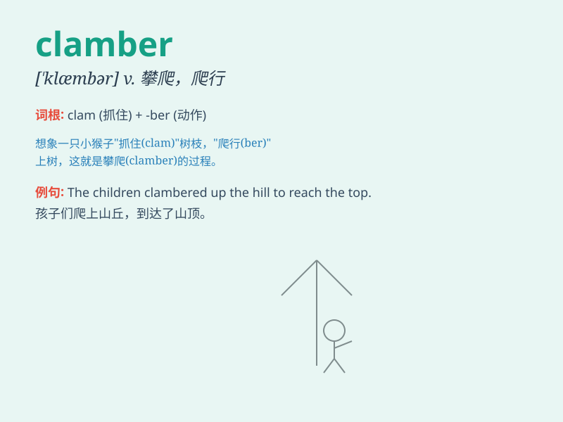

## clamber

**英音:** _[\'klæmbə]_ **美音:** _[\'klæmbɚ]_

**译义:** *vi.爬上,攀登*

### 短语

+ **clamber up:** _爬上；攀登_

+ **clamber over:** _爬过；翻越_

+ **clamber onto:** _爬上；爬到\...\...上_

+ **clamber down:** _爬下_

+ **clamber through:** _艰难地穿过_

### 例句

#### 例句1

> **The children clambered up the slide.**

**中文翻译:** 孩子们爬上了滑梯。

**单词释义:** 攀爬

#### 例句2

> **He clambered over the fence to get into the garden.**

**中文翻译:** 他翻过栅栏进入花园。

**单词释义:** 翻越

#### 例句3

> **The monkeys clambered among the branches of the tree.**

**中文翻译:** 猴子们在树枝间攀爬。

**单词释义:** 攀缘

### 背诵小故事

> A little monkey wanted to get the bananas on the tall tree. It had to
clamber up the trunk, using its hands and feet. Finally, it reached the
bananas and had a delicious meal.

**一只小猴子想要得到高树上的香蕉。它不得不手脚并用爬上树干。最终，它够到了香蕉，美餐了一顿。**

### 图义

