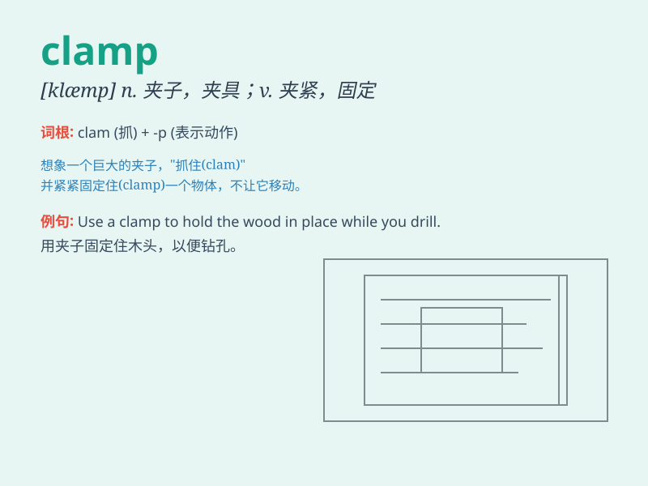

## clamp

**英音:** _[klæmp]_ **美音:** _[klæmp]_

**译义:** *n.夹子,夹具,夹钳vt.夹住,夹紧*

### 短语

+ **clamp down:** _严厉打击；强行限制_

+ **clamp on:** _夹紧；强加_

+ **voltage clamp:** _电压钳_

+ **clamp device:** _夹紧装置_

+ **clamp connection:** _夹钳连接_

### 例句

#### 例句1

> **The carpenter used a clamp to hold the wood in place.**

**中文翻译:** 木匠用一个夹子把木头固定住。

**单词释义:** 夹子；夹具

#### 例句2

> **The government has decided to clamp down on illegal
immigration.**

**中文翻译:** 政府已决定严厉打击非法移民。

**单词释义:** 严厉打击；强制实行

#### 例句3

> **She clamped her hand over her mouth to stop herself from
screaming.**

**中文翻译:** 她用手紧紧捂住嘴，不让自己尖叫出来。

**单词释义:** 紧紧抓住；紧夹住

### 背诵小故事

> A thief was trying to steal a precious gem. The police quickly came
and used a clamp to hold his hands firmly, preventing him from escaping.
The clamp was very strong and reliable.

**一个小偷正试图偷一颗珍贵的宝石。警察迅速赶来并用夹子紧紧夹住他的手，防止他逃跑。这个夹子非常坚固可靠。**

### 图义

