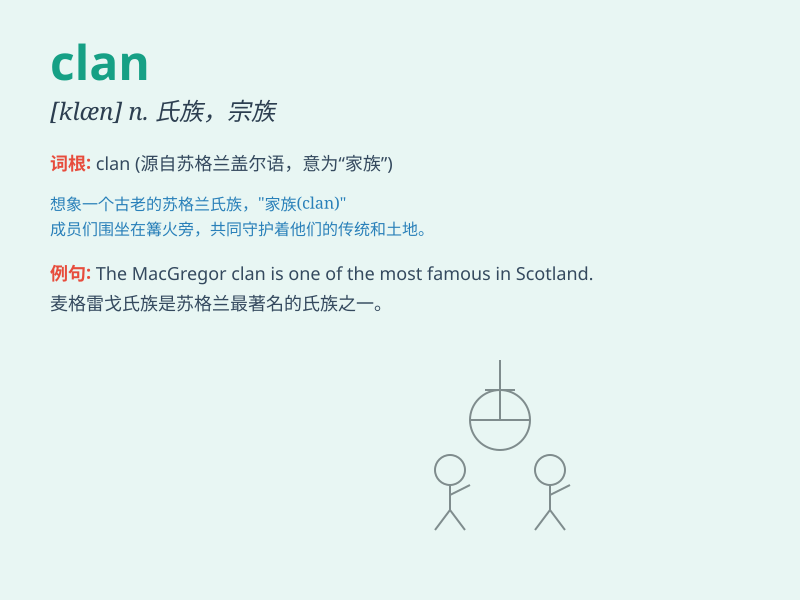

## clan

**英音:** _[klæn]_ **美音:** _[klæn]_

**译义:** *n.部落,氏族,宗族,党派*

### 短语

+ **clan warfare:** _宗族战争_

+ **clan chief:** _宗族首领_

+ **clan member:** _宗族成员_

+ **clan gathering:** _宗族聚会_

+ **clan structure:** _宗族结构_

### 例句

#### 例句1

> **The MacGregor clan is one of the most famous in Scotland.**

**中文翻译:** 麦格雷戈家族是苏格兰最著名的家族之一。

**单词释义:** 家族；氏族

#### 例句2

> **The two clans have been at war for years.**

**中文翻译:** 这两个家族已经交战多年。

**单词释义:** 家族；宗派

#### 例句3

> **The members of the clan gathered for the annual celebration.**

**中文翻译:** 家族成员们聚集在一起参加年度庆典。

**单词释义:** 家族；宗族

### 背诵小故事

> A long time ago, in a faraway village, there was a group of people
who always helped each other. They were like a big family and were
called a clan. They shared food and protected each other from danger.

**很久以前，在一个遥远的村庄里，有一群总是互相帮助的人。他们就像一个大家庭，被称为氏族。他们共享食物，并相互保护免受危险。**

### 图义

