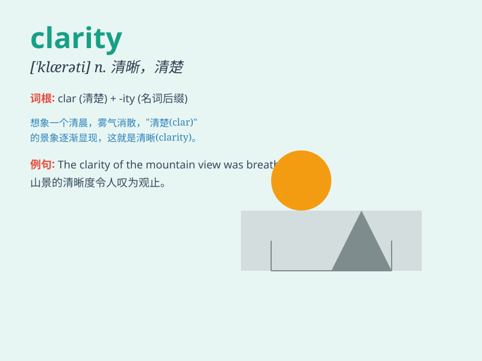

## clarity

**英音:** _[\'klærɪtɪ]_ **美音:** _[\'klærəti]_

**译义:** *n.清楚,透明*

### 短语

+ **clarity of thought:** _思路清晰_

+ **clarity of vision:** _清晰的视野_

+ **clarity of expression:** _表达清晰_

+ **lack of clarity:** _缺乏清晰性_

+ **gain clarity:** _变得清晰_

### 例句

#### 例句1

> **The clarity of her writing made the complex topic easy to
understand.**

**中文翻译:** 她的写作清晰易懂，使复杂的主题变得容易理解。

**单词释义:** 清晰；清楚

#### 例句2

> **The mountain air brought a clarity to his mind.**

**中文翻译:** 山间的空气让他的头脑变得清晰起来。

**单词释义:** 清晰；明晰

#### 例句3

> **The new policy lacks clarity and has caused confusion.**

**中文翻译:** 新政策缺乏明确性，造成了混乱。

**单词释义:** 清晰；明确

### 背诵小故事

> A detective was solving a complex case. After days of investigation,
he finally found the key evidence, and everything had clarity. Just like
fog disappearing, all became clear and understandable.

**一位侦探正在侦破一起复杂的案件。经过数天的调查，他终于找到了关键证据，一切都变得清晰明了。就像迷雾消散，所有的都变得清晰易懂。**

### 图义

