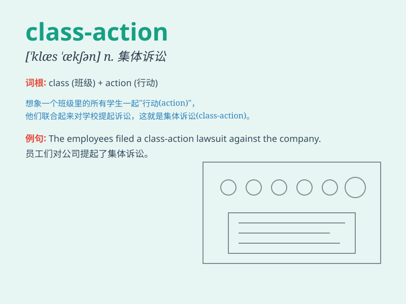

## class-action

**英音:** _[ˈklɑːs ˌækʃn]_ **美音:** _[ˈklæs ˌækʃn]_

**译义:**
*n.集体诉讼，指多名受害者联合起来对被告提起的诉讼，通常用于处理涉及广泛且类似违法行为的情况*

### 短语

+ **class-action lawsuit:** _集体诉讼_

+ **class-action settlement:** _集体诉讼和解_

+ **class-action claim:** _集体诉讼主张_

+ **class-action case:** _集体诉讼案件_

+ **class-action attorney:** _集体诉讼律师_

### 例句

#### 例句1

> **The class-action lawsuit alleged unfair business practices by the
company.**

**中文翻译:** 这起集体诉讼指控该公司存在不公平的商业行为。

**单词释义:** 集体诉讼

#### 例句2

> **The judge approved the settlement in the class-action case.**

**中文翻译:** 法官批准了这起集体诉讼案件的和解方案。

**单词释义:** 集体诉讼

#### 例句3

> **A large number of consumers joined the class-action against the
manufacturer.**

**中文翻译:** 大量消费者加入了针对制造商的集体诉讼。

**单词释义:** 集体诉讼

### 背诵小故事

> In a big school, many students were treated unfairly. So, they
grouped together for a class-action lawsuit. They fought as a class to
get justice.

**在一所大学校里，许多学生受到了不公平的对待。于是，他们一起提起了集体诉讼。他们作为一个整体为争取公正而战。**

### 图义

