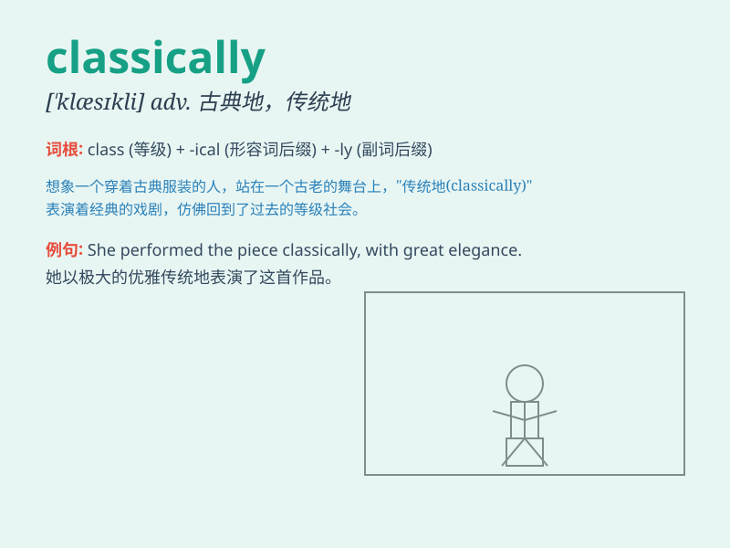

## classically

**英音:** _[ˈklæsɪkli]_ **美音:** _[ˈklæsɪkli]_

**译义:** *adv.古典主义地,拟古地*

### 短语

+ **classically trained:** _受过古典式训练的_

+ **classically styled:** _古典风格的_

+ **classically influenced:** _受古典影响的_

+ **classically beautiful:** _古典美的_

+ **classically proportioned:** _比例古典的_

### 例句

#### 例句1

> **She is classically beautiful with her elegant posture.**

**中文翻译:** 她的身姿优雅，具有古典美。

**单词释义:** 以古典的方式；典型地

#### 例句2

> **The building is classically designed with symmetrical
facades.**

**中文翻译:** 该建筑设计古典，立面对称。

**单词释义:** 古典风格地

#### 例句3

> **His music is classically influenced but with a modern twist.**

**中文翻译:** 他的音乐受到古典主义的影响，但又带有现代的色彩。

**单词释义:** 经典地；传统地

### 背诵小故事

> A student was always classically dressed for school. One day, he wore
modern clothes and everyone was surprised. He then realized that
classically means in a traditional or typical way.

**一名学生上学总是穿着传统风格的服装。有一天，他穿了现代的衣服，所有人都很惊讶。然后他明白了classically意思是传统地、典型地。**

### 图义

