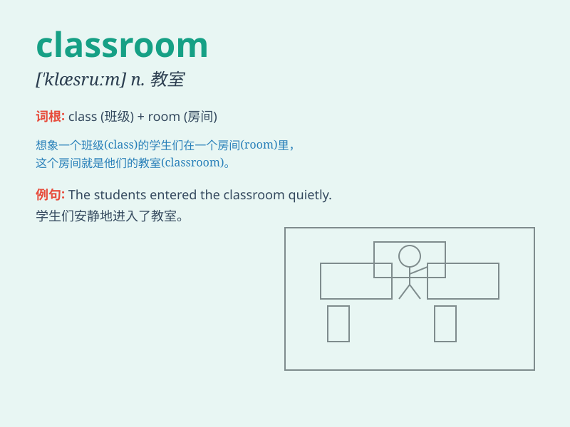

## classroom

**英音:** _[\'klɑːsruːm; -rʊm]_ **美音:** _[\'klæsrʊm]_

**译义:** *n.教室*

### 短语

+ **classroom teaching:** _课堂教学_

+ **classroom activity:** _课堂活动_

+ **classroom management:** _课堂管理_

+ **classroom environment:** _课堂环境_

+ **classroom discipline:** _课堂纪律_

### 例句

#### 例句1

> **The students are in the classroom.**

**中文翻译:** 学生们都在教室里。

**单词释义:** 教室

#### 例句2

> **Our classroom is very clean and tidy.**

**中文翻译:** 我们的教室非常干净整洁。

**单词释义:** 教室

#### 例句3

> **The teacher is standing in the front of the classroom.**

**中文翻译:** 老师站在教室前面。

**单词释义:** 教室

### 背诵小故事

> One day, Tom was late for class. When he rushed into the classroom,
all the students were quiet and the teacher was writing on the
blackboard. Tom realized that the classroom was a place for learning and
needed to be respected.

**一天，汤姆上课迟到了。当他冲进教室时，所有的学生都很安静，老师正在黑板上写字。汤姆意识到教室是学习的地方，需要被尊重。**

### 图义

