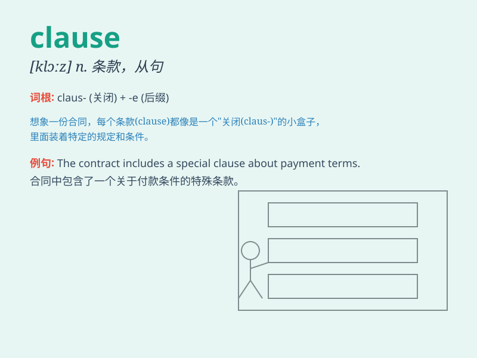

## clause

**英音:** _[klɔːz]_ **美音:** _[klɔz]_

**译义:** *n.子句,条款*

### 短语

+ **arbitration clause:** _仲裁条款_

+ **contract clause:** _合同条款_

+ **exemption clause:** _免责条款_

+ **penalty clause:** _罚款条款_

+ **salvation clause:** _保留条款_

### 例句

#### 例句1

> **The contract contains a penalty clause.**

**中文翻译:** 合同中包含处罚条款。

**单词释义:** 条款

#### 例句2

> **A restrictive clause limits the meaning of the word it
modifies.**

**中文翻译:** 限制性从句限制其所修饰词的含义。

**单词释义:** 从句

#### 例句3

> **The insurance policy has an exemption clause.**

**中文翻译:** 保险单有豁免条款。

**单词释义:** 条款

### 背诵小故事

> 想象你正在签订一份合同，其中有个重要部分叫 clause
（条款）。比如'保密条款''付款条款'，这些条款决定了双方的权利和义务。就像一条条规则，规范着合同的执行。

**想象在签订合同中理解 clause
（条款）这个单词，它就像合同中的一条条规则，决定双方权利义务。**

### 图义

