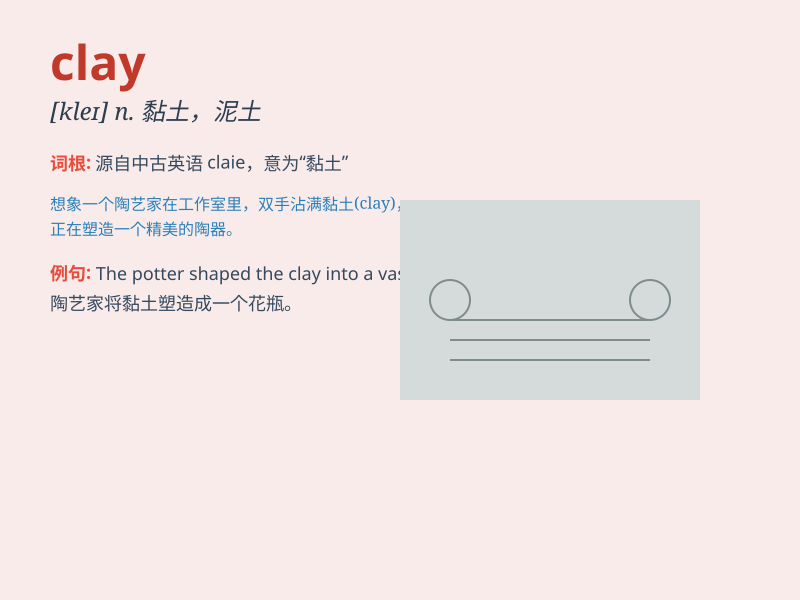

## clay

**英音:** _[kleɪ]_ **美音:** _[kle]_

**译义:** *n.粘土,泥土,肉体,人体,似黏土的东西,陶土制的烟斗*

### 短语

+ **clay soil:** _黏土土壤_

+ **clay pigeon:** _陶土飞靶；易被捉弄的人_

+ **clay court:** _红土球场_

+ **clay model:** _黏土模型_

+ **clay sculpture:** _黏土雕塑_

### 例句

#### 例句1

> **The potter shaped the clay into a beautiful vase.**

**中文翻译:** 这位陶工把黏土塑造成了一个漂亮的花瓶。

**单词释义:** 黏土；陶土

#### 例句2

> **His hands were covered in clay after working in the garden.**

**中文翻译:** 在花园里劳作后，他的双手沾满了黏土。

**单词释义:** 黏土

#### 例句3

> **The children were playing with clay, making various figures.**

**中文翻译:** 孩子们正在玩黏土，制作各种形状。

**单词释义:** 黏土

### 背诵小故事

> One day, a little boy was playing in the garden and found a lump of
clay. He used the clay to make a cute little animal. The clay was soft
and malleable, allowing him to create freely.

**有一天，一个小男孩在花园里玩耍，发现了一块黏土。他用这块黏土做了一个可爱的小动物。黏土柔软且可塑，让他能够自由创作。**

### 图义

