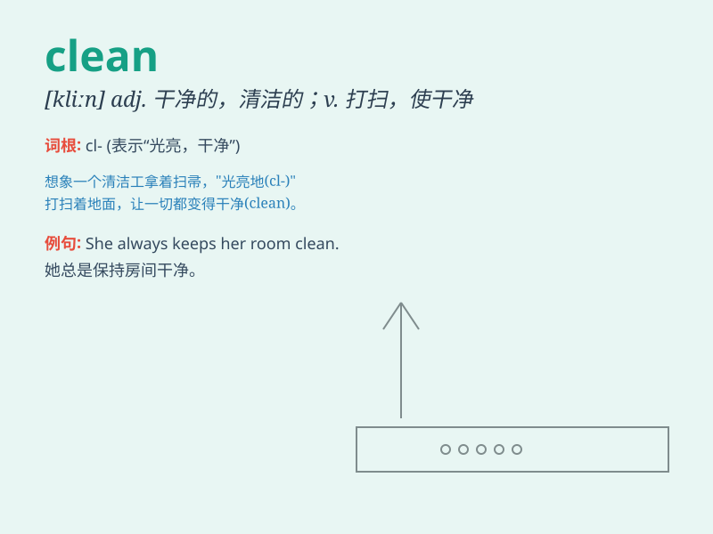

## clean

**英音:** _[kliːn]_ **美音:** _[klin]_

**译义:** *adj.清洁的,干净的,清白的v.打扫,使干净,清扫*

### 短语

+ **clean up:** _打扫；清理；整顿_

+ **clean out:** _清除；打扫干净_

+ **clean off:** _清除；擦去_

+ **keep clean:** _保持清洁_

+ **come clean:** _全盘招供；坦白交待_

### 例句

#### 例句1

> **I clean my room every day.**

**中文翻译:** 我每天打扫我的房间。

**单词释义:** 打扫；清扫

#### 例句2

> **The water in the river is very clean.**

**中文翻译:** 这条河里的水非常干净。

**单词释义:** 干净的；清洁的

#### 例句3

> **She had to clean the wound carefully.**

**中文翻译:** 她不得不仔细清理伤口。

**单词释义:** 清理；清除

### 背诵小故事

> One day, Tom\'s room was very messy. His mother said, \'Tom, you must
clean your room.\' So Tom started to put away toys, wipe the table and
sweep the floor. Finally, the room became clean and tidy.

**一天，汤姆的房间非常凌乱。他妈妈说：'汤姆，你必须打扫你的房间。'于是汤姆开始收拾玩具、擦桌子和扫地。最后，房间变得干净整洁。**

### 图义

