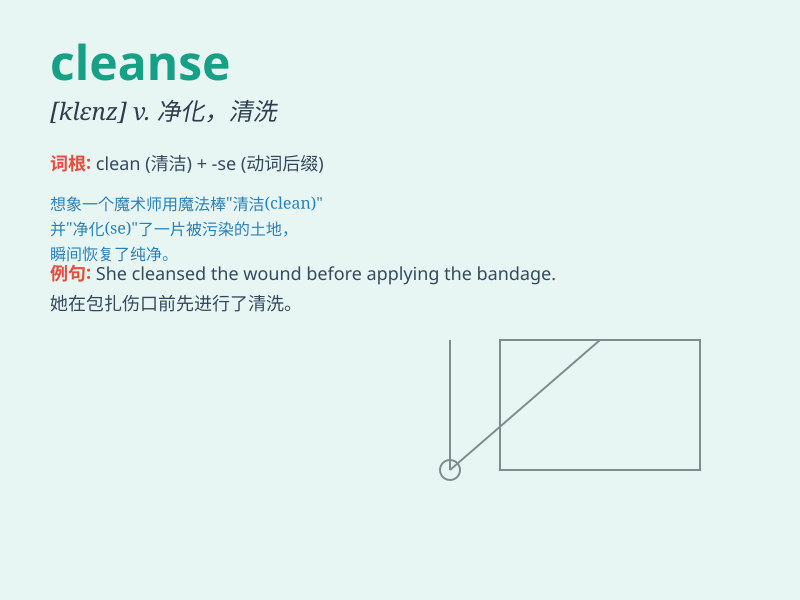

## cleanse

**英音:** _[klenz]_ **美音:** _[klɛnz]_

**译义:** *v.纯净*

### 短语

+ **cleanse thoroughly:** _彻底清洁_

+ **cleanse the skin:** _清洁皮肤_

+ **cleanse the soul:** _净化灵魂_

+ **cleanse the body:** _清洁身体_

+ **cleanse the mind:** _净化心灵_

### 例句

#### 例句1

> **The doctor recommended a special diet to cleanse the body of
toxins.**

**中文翻译:** 医生建议通过特殊的饮食来清除体内的毒素。

**单词释义:** 清除；净化

#### 例句2

> **She used a facial cleanser to cleanse her skin.**

**中文翻译:** 她使用了一款洗面奶来清洁她的皮肤。

**单词释义:** 清洁；洗净

#### 例句3

> **The ritual is believed to cleanse the soul.**

**中文翻译:** 这种仪式被认为能够净化灵魂。

**单词释义:** 净化

### 背诵小故事

> A brave knight was on a quest to cleanse a haunted forest. The evil
spirits had made the place dark and scary. With his magic sword, he
fought and purified the forest, making it beautiful and peaceful again.
\'Cleansed\' means to make clean and pure.

**一位勇敢的骑士踏上了净化一座闹鬼森林的征程。邪恶的幽灵让这个地方变得黑暗和可怕。他用他的魔法剑战斗并净化了森林，使其再次变得美丽和宁静。\'cleanse\'意思是使清洁、使纯净。**

### 图义

