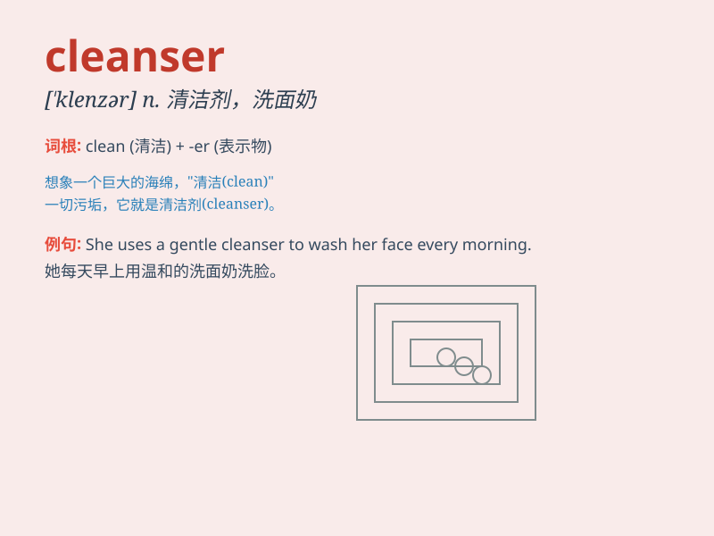

## cleanser

**英音:** _[\'klenzə]_ **美音:** _[\'klɛnzɚ]_

**译义:** *n.清洁剂,使清洁的东西,擦亮粉*

### 短语

+ **facial cleanser:** _洗面奶_

+ **makeup cleanser:** _卸妆洁面乳_

+ **skin cleanser:** _皮肤清洁剂_

+ **gentle cleanser:** _温和的清洁剂_

+ **deep cleansing cleanser:** _深层清洁洁面乳_

### 例句

#### 例句1

> **I use a facial cleanser every morning to keep my skin clean.**

**中文翻译:** 我每天早上使用一款洗面奶来保持皮肤清洁。

**单词释义:** 洗面奶

#### 例句2

> **This cleanser is effective in removing stubborn stains.**

**中文翻译:** 这种清洁剂能有效去除顽固污渍。

**单词释义:** 清洁剂

#### 例句3

> **The hand cleanser in the bathroom is almost empty.**

**中文翻译:** 浴室里的洗手液几乎用完了。

**单词释义:** 洗手液

### 背诵小故事

> One day, Mary\'s face was very dirty. She needed a cleanser to make
it clean. So she found a special cleanser and used it carefully. After
that, her face became fresh and shiny.

**有一天，玛丽的脸非常脏。她需要清洁剂来让脸变干净。于是她找到了一种特别的清洁剂，并小心翼翼地使用。之后，她的脸变得清新又有光泽。**

### 图义

