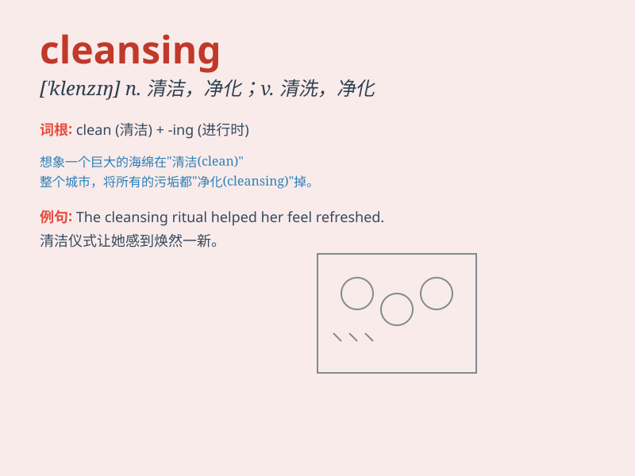

## cleansing

**英音:** _[\'klenzɪŋ]_ **美音:** _[\'klɛnzɪŋ]_

**译义:** * 清洁,使清洁的人或物;adj.有去污作用的*

### 短语

+ **cleansing cream:** _清洁霜_

+ **cleansing lotion:** _洁肤露_

+ **cleansing mask:** _清洁面膜_

+ **deep cleansing:** _深度清洁_

+ **facial cleansing:** _面部清洁_

### 例句

#### 例句1

> **The facial cleansing gel helps remove dirt and impurities.**

**中文翻译:** 这款洁面啫喱有助于去除污垢和杂质。

**单词释义:** 清洁；清洗

#### 例句2

> **She went through a spiritual cleansing after the traumatic
event.**

**中文翻译:** 在那次创伤性事件之后，她经历了一次精神上的净化。

**单词释义:** 净化；清除

#### 例句3

> **The cleansing of the river is a long-term project.**

**中文翻译:** 这条河的清理是一个长期的项目。

**单词释义:** 清理；清扫

### 背诵小故事

> A brave knight was on a quest to find a magical spring with cleansing
powers. When he finally reached it and bathed in the water, all the dirt
and evil spells on him vanished. The word \'cleansing\' means to make
clean or pure.

**一位勇敢的骑士正在寻找具有清洁力量的神奇泉水。当他终于到达并在水中沐浴时，他身上所有的污垢和邪恶咒语都消失了。单词\'cleansing\'的意思是使清洁或纯净。**

### 图义

