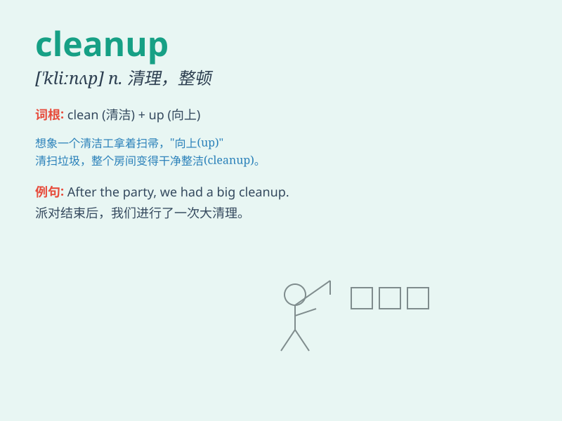

## cleanup

**英音:** _[\'kliːnʌp]_ **美音:** _[\'klin,ʌp]_

**译义:** *n.清除,获利*

### 短语

+ **environmental cleanup:** _环境清理_

+ **cleanup crew:** _清理人员_

+ **cleanup operation:** _清理行动_

+ **data cleanup:** _数据清理_

+ **site cleanup:** _场地清理_

### 例句

#### 例句1

> **The city organized a major cleanup of the riverbanks.**

**中文翻译:** 这座城市组织了一次对河岸的大规模清理。

**单词释义:** 清理；清扫

#### 例句2

> **We need to do a cleanup in the garage.**

**中文翻译:** 我们需要清理一下车库。

**单词释义:** 清理；打扫

#### 例句3

> **The company\'s financial cleanup helped improve its image.**

**中文翻译:** 公司的财务清理有助于改善其形象。

**单词释义:** 整顿；清理

### 背诵小故事

> One day, there was a big mess in the park. Volunteers came for a
cleanup. They picked up trash, swept the paths, and made the park
beautiful again. Remember, cleanup means to make a place clean and tidy.

**有一天，公园里一片狼藉。志愿者们前来进行清理。他们捡垃圾，清扫道路，让公园再次变得美丽。记住，cleanup
意思是清理，使某处整洁。**

### 图义

