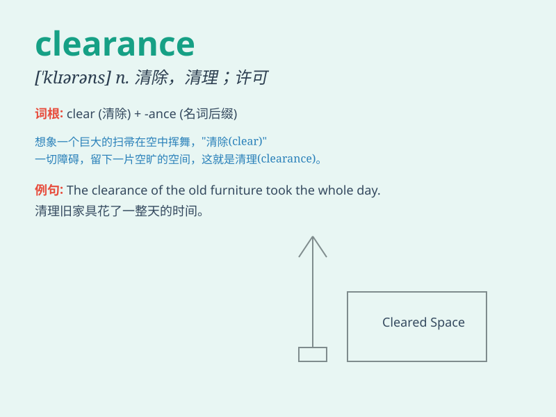

## clearance

**英音:** _[\'klɪər(ə)ns]_ **美音:** _[\'klɪrəns]_

**译义:** *n.清除*

### 短语

+ **customs clearance:** _海关放行；结关_

+ **clearance sale:** _清仓甩卖_

+ **security clearance:** _安全许可；安全审查_

+ **clearance rate:** _清除率；清偿率_

+ **ground clearance:** _离地间隙_

### 例句

#### 例句1

> **The truck needs a clearance of at least three meters to pass
under the bridge.**

**中文翻译:** 这辆卡车需要至少三米的净空才能从桥下通过。

**单词释义:** 净空；空隙

#### 例句2

> **She got clearance to start the new project.**

**中文翻译:** 她获得了开始新项目的许可。

**单词释义:** 许可；批准

#### 例句3

> **The store is having a clearance sale.**

**中文翻译:** 这家商店正在进行清仓大甩卖。

**单词释义:** 清仓；清除

### 背诵小故事

> A thief was running in a crowded market. But the police managed to
clear the way and get a clearance to catch him. Finally, they arrested
the thief and restored order.

**一个小偷在拥挤的市场里逃窜。但警察设法清理出道路，并获得许可去抓他。最终，他们逮捕了小偷，恢复了秩序。**

### 图义

