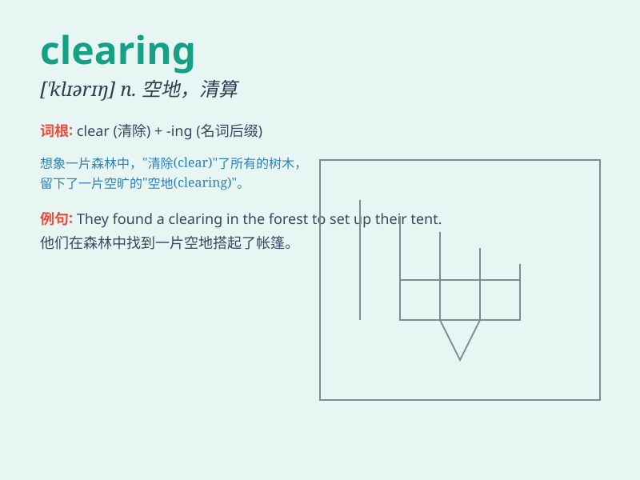

## clearing

**英音:** _[\'klɪərɪŋ]_ **美音:** _[\'klɪrɪŋ]_

**译义:** *n.空旷地*

### 短语

+ **clearing house:** _票据交换所；清算所_

+ **clearing sale:** _清仓甩卖_

+ **clearing account:** _清算账户；结算账户_

+ **forest clearing:** _森林开垦；森林清理_

+ **land clearing:** _土地清理；开荒_

### 例句

#### 例句1

> **The clearing in the forest was a beautiful spot for a picnic.**

**中文翻译:** 森林中的那块空地是野餐的美丽地点。

**单词释义:** 空地

#### 例句2

> **After the storm, there was a clearing in the clouds.**

**中文翻译:** 暴风雨过后，云层中有了一片晴朗的区域。

**单词释义:** 晴朗的区域

#### 例句3

> **The bank is responsible for the clearing of checks.**

**中文翻译:** 银行负责支票的清算。

**单词释义:** 清算

### 背诵小故事

> A brave explorer was lost in a thick forest. After days of wandering,
he finally reached a clearing. There, he saw a beautiful lake and found
his way out. The clearing was his salvation.

**一位勇敢的探险家在茂密的森林中迷路了。经过数天的徘徊，他终于到达了一片空地。在那里，他看到了一个美丽的湖泊，并找到了出路。这片空地是他的救星。**

### 图义

