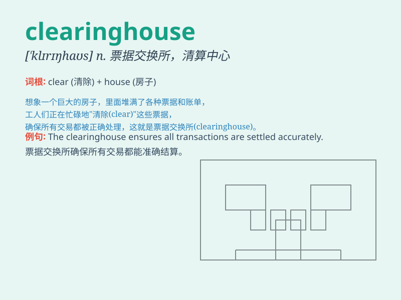

## clearinghouse

**英音:** _[\'klɪərɪŋhaʊs]_ **美音:** _[\'klɪrɪŋ,haʊs]_

**译义:** *n.票据交换所*

### 短语

+ **financial clearinghouse:** _金融票据交换所_

+ **information clearinghouse:** _信息交换中心_

+ **data clearinghouse:** _数据交换所_

+ **clearinghouse system:** _票据交换所系统_

+ **clearinghouse services:** _票据交换所服务_

### 例句

#### 例句1

> **The clearinghouse ensures the smooth flow of financial
transactions.**

**中文翻译:** 票据交换所确保金融交易的顺利进行。

**单词释义:** 票据交换所

#### 例句2

> **The information clearinghouse collects and distributes data on
various topics.**

**中文翻译:** 这个信息交换中心收集并分发关于各种主题的数据。

**单词释义:** 交换中心

#### 例句3

> **The clearinghouse acts as an intermediary between different
organizations.**

**中文翻译:** 这个交换所充当不同组织之间的中介。

**单词释义:** 交换所

### 背诵小故事

> 想象一个繁忙的金融市场，有个神秘的地方叫 clearinghouse
。它就像一个超级管家，接收和整理各方的交易信息，确保每一笔交易都准确无误，让资金流动顺畅无阻。

**想象在繁忙的金融市场中，clearinghouse
如同超级管家，接收和整理交易信息，保障交易准确和资金流畅。**

### 图义

