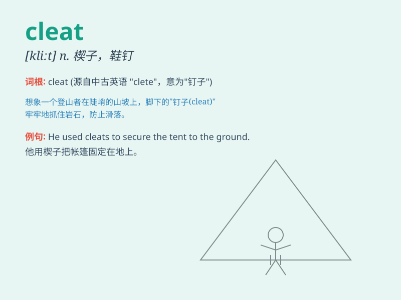

## cleat

**英音:** _[kliːt]_ **美音:** _[klit]_

**译义:** *n.夹板*

### 短语

+ **shoe cleat:** _鞋钉_

+ **cleat hitch:** _羊角结_

+ **bicycle cleat:** _自行车脚踏板扣片_

+ **cleat insulator:** _夹板绝缘子_

+ **wire cleat:** _电线夹板_

### 例句

#### 例句1

> **The sailor fastened the rope to the cleat on the deck.**

**中文翻译:** 水手把绳子系在甲板上的系索耳上。

**单词释义:** 系索耳；栓

#### 例句2

> **The cleat on the bottom of the shoe provided good traction on the
slippery surface.**

**中文翻译:** 鞋底的鞋钉在光滑的表面上提供了良好的牵引力。

**单词释义:** （鞋底等的）防滑钉

#### 例句3

> **He attached the bike to the cleat in the garage.**

**中文翻译:** 他把自行车固定在车库里的栓上。

**单词释义:** 栓；夹板

### 背诵小故事

>
想象在一场激烈的足球比赛中，球员们快速奔跑。突然，一位球员的鞋钉（cleat）掉了，他差点滑倒。大家这才注意到鞋钉对于稳定和抓地力是多么重要。

**想象在足球比赛中球员鞋钉掉了的场景来记住 cleat
这个单词，意思是鞋钉、防滑钉**

### 图义

