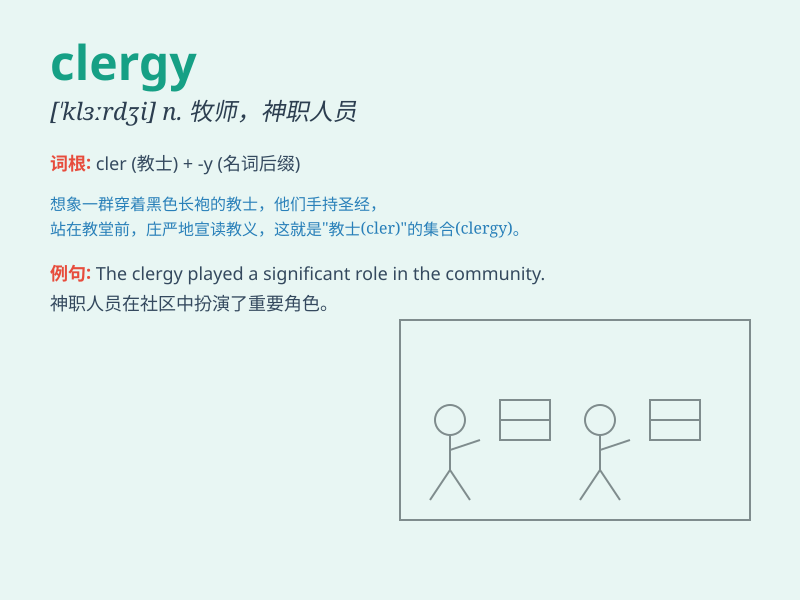

## clergy

**英音:** _[\'klɜːdʒɪ]_ **美音:** _[\'klɝdʒi]_

**译义:** *n.(集合称)圣职者,牧师,僧侣,神职人员*

### 短语

+ **the clergy:** _神职人员（总称）_

+ **ordain clergy:** _任命神职人员_

+ **clergy member:** _神职人员成员_

+ **clergy training:** _神职人员培训_

+ **local clergy:** _当地神职人员_

### 例句

#### 例句1

> **The clergy played an important role in the community.**

**中文翻译:** 神职人员在社区中发挥了重要作用。

**单词释义:** 神职人员

#### 例句2

> **She consulted the clergy for spiritual guidance.**

**中文翻译:** 她向神职人员寻求精神指引。

**单词释义:** 神职人员

#### 例句3

> **The local clergy organized a charity event.**

**中文翻译:** 当地的神职人员组织了一场慈善活动。

**单词释义:** 神职人员

### 背诵小故事

>
想象一个古老的小镇，每当有重大事件，一群身穿长袍的人就会出现引导大家。他们就是
clergy ，被视为宗教的指引者。他们用智慧和信仰，给人们带来心灵的慰藉。

**想象一个关于\'clergy（神职人员）\'的故事，描述他们在小镇中的引导作用，以辅助记忆**

### 图义

