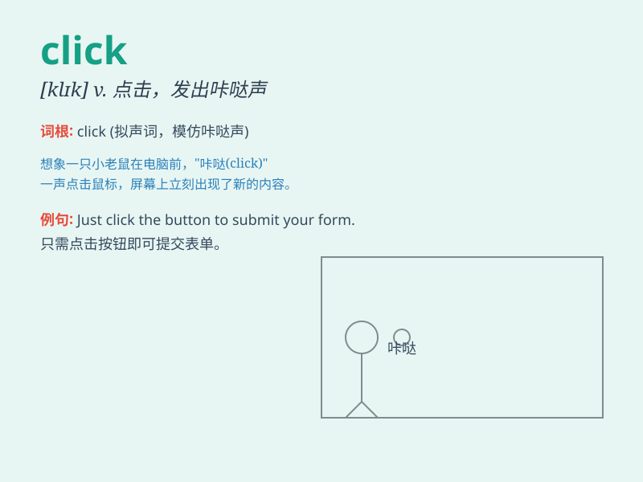

## click

**英音:** _[klɪk]_ **美音:** _[klɪk]_

**译义:** *v.发出滴答声n.滴答声*

### 短语

+ **click on:** _点击；用鼠标点击_

+ **click through:** _点击链接进入_

+ **double click:** _双击_

+ **single click:** _单击_

+ **click rate:** _点击率_

### 例句

#### 例句1

> **The mouse click was too loud.**

**中文翻译:** 鼠标的点击声太大了。

**单词释义:** 点击（动作）

#### 例句2

> **Click the link to visit the website.**

**中文翻译:** 点击这个链接来访问网站。

**单词释义:** 点击（动词，指使某物通过点击产生某种效果）

#### 例句3

> **The camera won\'t click until you press the button harder.**

**中文翻译:** 直到你更用力地按按钮，相机才会咔嚓作响。

**单词释义:** 发出咔嚓声（拟声词）

### 背诵小故事

> One day, I was in a dark room and heard a strange sound. When I
turned on the light with a \'click\', I saw a mouse running away. The
\'click\' of the switch made me remember this word.

**有一天，我在一个黑暗的房间里，听到了一个奇怪的声音。当我'咔哒'一声打开灯时，我看到一只老鼠跑开了。开关的'咔哒'声让我记住了这个单词。**

### 图义

