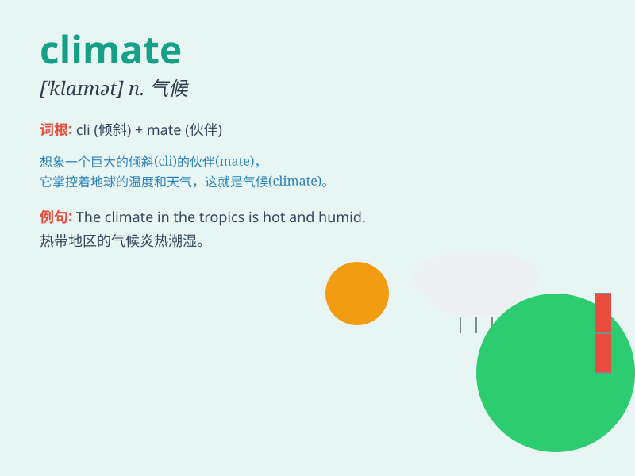

## climate

**英音:** _[ˈklaɪmɪt]_ **美音:** _[ˈklaɪmət]_

**译义:** *n.气候,风土,思潮*

### 短语

+ **climate change:** _气候变化_

+ **mild climate:** _温和的气候_

+ **harsh climate:** _恶劣的气候_

+ **tropical climate:** _热带气候_

+ **continental climate:** _大陆性气候_

### 例句

#### 例句1

> **The climate in this region is very pleasant.**

**中文翻译:** 这个地区的气候非常宜人。

**单词释义:** 气候

#### 例句2

> **We need to take action to protect the climate.**

**中文翻译:** 我们需要采取行动保护气候。

**单词释义:** 气候

#### 例句3

> **The changing climate has a significant impact on agriculture.**

**中文翻译:** 气候变化对农业产生重大影响。

**单词释义:** 气候

### 背诵小故事

> A brave adventurer traveled to different places. In the desert, it
was hot; in the mountains, it was cold. He realized that these different
conditions were all part of the \'climate\'. Finally, he understood how
climate shapes our world.

**一位勇敢的冒险家游历了不同的地方。在沙漠，天气炎热；在山区，天气寒冷。他意识到这些不同的状况都是'气候'的一部分。最终，他明白了气候是如何塑造我们的世界的。**

### 图义

