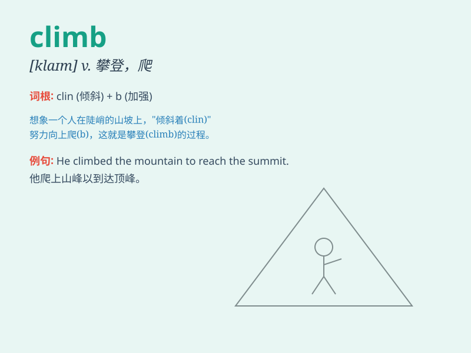

## climb

**英音:** _[klaɪm]_ **美音:** _[klaɪm]_

**译义:** *v.攀登,爬n.攀登,爬*

### 短语

+ **climb up:** _爬上；攀登_

+ **climb down:** _爬下；让步_

+ **climb over:** _翻过；爬过_

+ **climb the mountain:** _爬山_

+ **climb a tree:** _爬树_

### 例句

#### 例句1

> **He climbed the mountain with great difficulty.**

**中文翻译:** 他费了九牛二虎之力才爬上了那座山。

**单词释义:** 爬

#### 例句2

> **The little monkey climbed up the tree quickly.**

**中文翻译:** 小猴子很快就爬上了树。

**单词释义:** 爬上

#### 例句3

> **She has been climbing the career ladder steadily.**

**中文翻译:** 她的职业阶梯一直在稳步攀登。

**单词释义:** 攀登

### 背诵小故事

> One day, a little monkey wanted to get the bananas on the tall tree.
It started to climb up the tree very carefully. With its efforts, it
finally reached the bananas. The word \'climb\' means to go up
something, like the monkey climbing the tree.

**一天，一只小猴子想要得到高树上的香蕉。它开始非常小心地往树上爬。通过努力，它最终够到了香蕉。单词\'climb\'意思是向上爬某物，就像猴子爬树那样。**

### 图义

