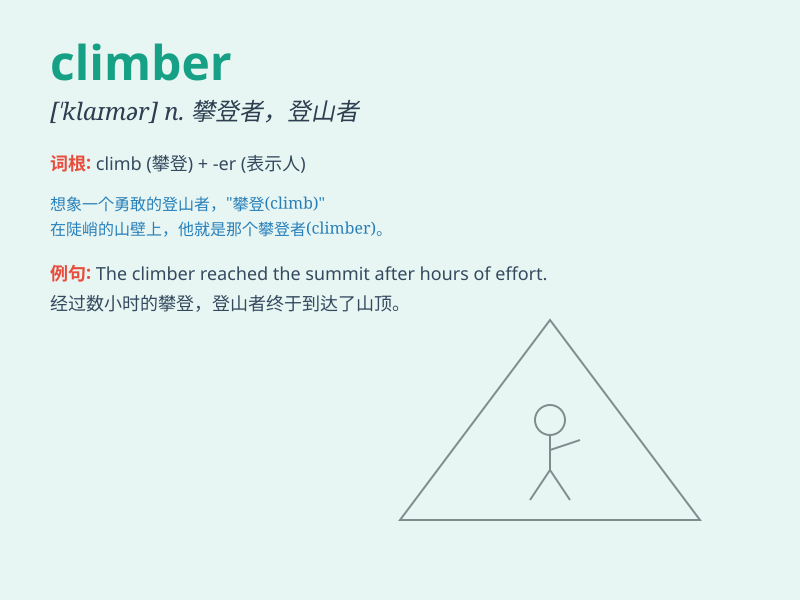

## climber

**英音:** _[\'klaɪmə]_ **美音:** _[\'klaɪmɚ]_

**译义:** *n.登山者,攀缘植物*

### 短语

+ **mountain climber:** _登山者_

+ **rock climber:** _攀岩者_

+ **professional climber:** _职业攀登者_

+ **experienced climber:** _经验丰富的攀登者_

+ **beginner climber:** _初级攀登者_

### 例句

#### 例句1

> **The climber reached the summit after a challenging climb.**

**中文翻译:** 经过一番艰难的攀登后，登山者到达了山顶。

**单词释义:** 登山者

#### 例句2

> **She is an experienced climber who has conquered many peaks.**

**中文翻译:** 她是一位经验丰富的登山者，征服过许多山峰。

**单词释义:** 登山者

#### 例句3

> **The climber carefully chose the equipment for the expedition.**

**中文翻译:** 登山者精心挑选了探险所需的装备。

**单词释义:** 登山者

### 背诵小故事

> One day, a brave climber decided to conquer the highest mountain. He
faced many difficulties but never gave up. Finally, he reached the peak
and became a hero. Remember, a climber is someone who climbs mountains.

**有一天，一位勇敢的登山者决定征服最高的山峰。他面临许多困难但从不放弃。最终，他到达了山顶，成为了英雄。记住，climber
就是登山的人。**

### 图义

