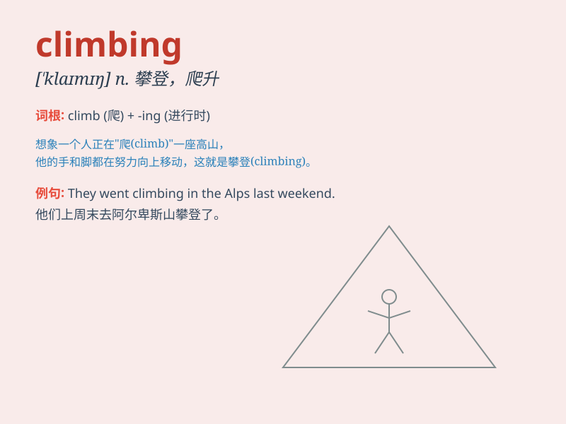

## climbing

**英音:** _[\'klaɪmɪŋ]_ **美音:** _[\'klaɪmɪŋ]_

**译义:** *adj.攀登的,上升的n.攀登*

### 短语

+ **mountain climbing:** _爬山；登山_

+ **rock climbing:** _攀岩_

+ **climbing frame:** _攀登架；儿童游乐攀登架_

+ **climbing plant:** _攀缘植物_

+ **climbing wall:** _攀岩墙_

### 例句

#### 例句1

> **I enjoy climbing mountains on weekends.**

**中文翻译:** 我喜欢周末爬山。

**单词释义:** 爬山

#### 例句2

> **She is passionate about rock climbing.**

**中文翻译:** 她热衷于攀岩。

**单词释义:** 攀岩

#### 例句3

> **The monkey is good at climbing trees.**

**中文翻译:** 猴子擅长爬树。

**单词释义:** 爬树

### 背诵小故事

> One day, Tom went climbing. He struggled at first but didn\'t give
up. Finally, he reached the top and saw the beautiful view. Climbing
made him feel brave and strong.

**有一天，汤姆去爬山。一开始他很吃力但没有放弃。最终，他到达了山顶，看到了美丽的景色。爬山让他感到勇敢和强大。**

### 图义

